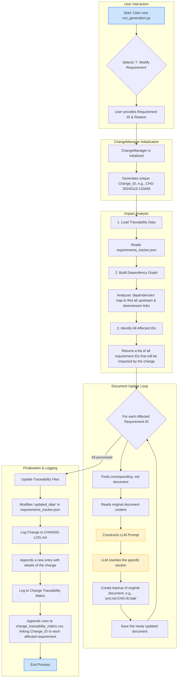

# CLAUDE.md

This file provides guidance to Claude Code (claude.ai/code) when working with code in this repository.

## Project Structure

```text
FY.WB.Midway/
├── .gitignore                           # Comprehensive ignore rules (ASP.NET Core + Next.js)
├── CLAUDE.md                           # This file - development guidance
├── BackEnd/                            # ASP.NET Core Clean Architecture
│   ├── FY.WB.Midway/                  # 🎯 Main API Project (Presentation Layer)
│   │   ├── Controllers/               # API Controllers (thin, delegate to MediatR)
│   │   ├── StartupConfiguration/      # Modular startup configuration
│   │   ├── Properties/               # Launch settings
│   │   ├── Program.cs               # Application entry point
│   │   ├── appsettings.json         # Base configuration
│   │   └── appsettings.Development.json # Development overrides
│   ├── FY.WB.Midway.Application/      # 🧠 Application Layer (CQRS + Business Logic)
│   │   ├── Common/                   # Shared application concerns
│   │   │   ├── Behaviors/           # MediatR pipeline behaviors
│   │   │   ├── Dtos/               # Shared DTOs
│   │   │   ├── Exceptions/         # Custom exceptions
│   │   │   └── Interfaces/         # Application interfaces
│   │   ├── [Entity]/               # Per-entity organization:
│   │   │   ├── Commands/           # Create, Update, Delete commands
│   │   │   ├── Queries/            # GetById, GetAll queries
│   │   │   └── Dtos/              # Entity-specific DTOs
│   │   └── Models/                 # Application models
│   ├── FY.WB.Midway.Domain/          # 🏛️ Domain Layer (Core Business Logic)
│   │   ├── Entities/               # Domain entities
│   │   │   ├── Core/              # Base entity classes
│   │   │   └── [BusinessEntities] # Client, Invoice, Report, etc.
│   │   └── Interfaces/            # Domain service interfaces
│   └── FY.WB.Midway.Infrastructure/  # 🔧 Infrastructure Layer (Data + External Services)
│       ├── Configuration/          # Options classes
│       ├── Migrations/            # EF Core migrations
│       ├── Persistence/           # Database context & configurations
│       │   ├── Configurations/    # Entity configurations
│       │   ├── SeedData/         # JSON seed data files
│       │   └── Seeders/          # Data seeding logic
│       ├── Repositories/          # Specialized repositories
│       └── Services/             # Infrastructure services
├── FrontEnd/                          # 🌐 Next.js TypeScript Application
│   ├── src/                          # Source code
│   │   ├── components/              # React components
│   │   │   └── layouts/            # Layout components (Admin, Client, Public)
│   │   ├── contexts/               # React contexts (Auth, Tenant)
│   │   ├── lib/                    # Utility libraries
│   │   ├── pages/                  # Next.js pages (file-based routing)
│   │   │   ├── admin/             # Admin-specific pages
│   │   │   └── client/            # Client-specific pages
│   │   └── styles/                # Global styles
│   ├── public/                     # Static assets
│   ├── package.json               # Dependencies & scripts
│   ├── next.config.js             # Next.js configuration
│   ├── tailwind.config.js         # Tailwind CSS configuration
│   └── tsconfig.json              # TypeScript configuration
├── Requirements/                      # 📋 Comprehensive Project Documentation
    ├── Video Annotations/            # UI requirements from video analysis
    ├── consolidated-requirements/    # Master requirements & architecture
    ├── cross-system-analysis/       # Integration & workflow analysis
    ├── invoice-requirements/        # Invoice system specifications
    ├── logistics-requirements/      # Logistics system specifications
    └── requirements/                # Core system requirements
└── Requirements_Generation_System/    # 🤖 Automated Requirements Generator
    ├── orchestrator.py              # Core document generation engine
    ├── run_generation.py            # User interface with multi-model support
    ├── monitor.py                   # Real-time generation monitoring
    ├── utils.py                     # Utilities for validation and reporting
    └── config.yaml                  # System configuration
```

## Requirements Documentation Reference

The `D:\Repository\@Clients\FY.WB.Midway\Requirements\` directory contains comprehensive project documentation organized by domain and concern:

### 📁 **Video Annotations/**

- **Purpose**: UI/UX requirements extracted from stakeholder video demonstrations
- **Contents**: Detailed markdown files with user interface specifications
- **Files**:
  - `Customer Payment Process Overview_ui_requirements.markdown`
  - `How to Book a Load in Our System_ui_requirements.markdown`
  - `Invoice Processing Overview_ui_requirements.markdown`
  - `Notchify Carrier Payments Process 💰_ui_requirements.markdown`

### 📁 **consolidated-requirements/**

- **Purpose**: Master project documentation and high-level architecture
- **Contents**: Unified requirements and implementation roadmap
- **Key Files**:
  - `master-prd.md` - Product Requirements Document
  - `master-technical-architecture.md` - System architecture overview
  - `implementation-roadmap.md` - Development phases and milestones

### 📁 **cross-system-analysis/**

- **Purpose**: Integration patterns and cross-cutting concerns
- **Contents**: System integration strategies and data flow analysis
- **Key Files**:
  - `cross-system-data-model.md` - Unified data model
  - `end-to-end-workflows.md` - Business process flows
  - `integration-matrix.md` - System integration points
  - `unified-api-strategy.md` - API design patterns

### 📁 **invoice-requirements/**

- **Purpose**: Invoice management system specifications
- **Structure**:
  - `backend/` - API specifications (OpenAPI YAML)
  - `database/` - Database schema (SQL)
  - `frontend/` - React state management patterns
  - `product-management/` - PRD and FRD documents
  - `cross-cutting/` - Requirements traceability matrix (RTM)

### 📁 **logistics-requirements/**

- **Purpose**: Logistics and transportation management specifications
- **Structure**:
  - `backend/` - API specs and Business Requirements Document
  - `database/` - Data schema and Data Requirements Document
  - `frontend/` - UX/UI specifications and React patterns
  - `product-management/` - Product and Functional Requirements
  - `cross-cutting/` - Requirements tracking and traceability

### 📁 **requirements/**

- **Purpose**: Core system requirements and base functionality
- **Structure**:
  - `backend/` - Core API specifications and business rules
  - `database/` - Base database schema and data requirements
  - `frontend/` - Core UI patterns and state management
  - `product-management/` - Foundational product requirements
  - `cross-cutting/` - Requirements traceability and tracking

### 📊 **Requirements Traceability**

Each requirements domain includes:

- **RTM.csv** - Requirements Traceability Matrix linking business needs to implementation
- **requirements_tracker.json** - Structured requirement tracking with status and dependencies
- **API-OPEN.yaml** - OpenAPI 3.0 specifications for backend services
- **DB-SCHEMA.sql** - Database schema definitions
- **PRD.md** - Product Requirements Document
- **FRD.md** - Functional Requirements Document
- **BRD.md** - Business Requirements Document (where applicable)
- **DRD.md** - Data Requirements Document (where applicable)
- **UXSMD.md** - User Experience Specification and Mockup Document (where applicable)
- **REACT-STORE.md** - Frontend state management patterns

## Requirements Generation System

The `Requirements_Generation_System/` directory contains a Python-based system for automatically generating comprehensive requirements documentation with traceability.

### 📁 **Requirements_Generation_System/**

- **Purpose**: Automate the creation of requirements documents with proper traceability
- **Key Files**:
  - `orchestrator.py` - Core document generation engine
  - `run_generation.py` - User interface for running the system
  - `monitor.py` - Real-time generation monitoring
  - `utils.py` - Utilities for validation and reporting
  - `config.yaml` - System configuration

### 🔄 **Multi-Model Support**

The system supports multiple LLM providers for requirements generation:

- **OpenAI GPT-4o** - Default model with strong reasoning capabilities
- **Anthropic Claude-3-Opus** - Alternative with excellent document structuring
- **Google Gemini-1.5-Pro** - Option with strong technical understanding

### 🔑 **API Key Management**

The system includes a secure API key management system:

- Securely stores API keys in a JSON file with proper permissions
- Supports retrieving keys from environment variables or secure storage
- Provides a user-friendly interface for viewing and updating API keys
- Includes clear instructions for obtaining API keys from each provider

### 📊 **Document Generation**

The system generates the following document types with proper traceability:

- **BRD** - Business Requirements Document
- **PRD** - Product Requirements Document
- **FRD** - Functional Requirements Document
- **NFRD** - Non-Functional Requirements Document
- **DRD** - Data Requirements Document
- **DB_Schema** - Database Schema Document
- **API_OpenAPI** - API Specifications (OpenAPI format)
- **TRD** - Technical Requirements Document
- **Test_Plan** - Test Plan Document
- **RTM** - Requirements Traceability Matrix

### 🚀 **Usage**

Run the system with:

```bash
cd Requirements_Generation_System
python run_generation.py
```

The interactive menu allows you to:

1. **Full generation (all documents)** - Generate complete document set from scratch
2. **Resume from last checkpoint** - Continue interrupted generation from where it left off
3. **Generate specific documents** - Create only selected document types
4. **Validate existing documents** - Check document quality and traceability
5. **Generate traceability report** - Create comprehensive traceability analysis
6. **Manage API keys** - Configure and update LLM provider credentials

### ⚡ **Resume Functionality**

The system now includes robust checkpoint and resume capabilities:

#### **🔄 Automatic State Persistence**

- **Status Files**: JSON files in `generation_status/` track each document's progress
- **Document Metadata**: YAML frontmatter in generated documents stores status and refinement counts
- **Progress Tracking**: Real-time calculation of completion percentage and remaining work
- **Smart Recovery**: Automatically detects and loads existing document states

#### **📊 Resume Detection**

- **State Analysis**: Scans both status files and generated documents for current state
- **Progress Display**: Shows completed, in-progress, failed, and remaining documents
- **Dependency Handling**: Maintains proper document generation order during resume
- **Error Recovery**: Gracefully handles partial completions and failed documents

#### **🎯 Intelligent Continuation**

- **Skip Completed**: Automatically skips already generated and validated documents
- **Continue from Checkpoint**: Resumes generation from the next required document
- **Status Preservation**: Maintains refinement counts and generation timestamps
- **Dependency Validation**: Ensures all prerequisite documents are available

### 🖥️ **Auto-Launch Dashboard**

The system automatically launches a real-time monitoring dashboard:

#### **🚀 Automatic Startup**

- **Backend Auto-Start**: FastAPI server launches automatically on port 8000
- **Browser Integration**: HTML dashboard opens automatically in default browser
- **Cross-Platform**: Works on Windows, macOS, and Linux systems
- **Error Handling**: Graceful fallback with manual instructions if auto-launch fails

#### **📈 Real-Time Monitoring**

- **Live Progress**: Visual progress circle showing completion percentage
- **Status Badges**: Color-coded indicators for completed, in-progress, failed, and not started
- **Document Table**: Detailed view of each document's status, size, refinements, and dependencies
- **Connection Status**: Real-time API connection indicator
- **Auto-Refresh**: Configurable refresh intervals (5s, 10s, 30s, 1m, 5m, or manual)

#### **📋 Dashboard Features**

- **Progress Visualization**: Circular progress indicator with percentage display
- **Status Summary**: Count badges for each document state
- **Time Tracking**: Generation start time, ETA, and average document time
- **Live Logs**: Real-time log viewing with different log levels (info, warning, error)
- **Document Details**: File sizes, refinement counts, generation timestamps
- **Dependency Tracking**: Visual representation of document dependencies

## Development Commands

### Backend (.NET 8.0 Web API)

- **Run**: `dotnet run --project BackEnd/FY.WB.Midway` (runs on port 5002)
- **Build**: `dotnet build BackEnd/FY.WB.Midway.sln`
- **Test**: `dotnet test BackEnd/FY.WB.Midway.sln`
- **Migrations**: `dotnet ef migrations add <name> --project BackEnd/FY.WB.Midway.Infrastructure --startup-project BackEnd/FY.WB.Midway`
- **Database Update**: `dotnet ef database update --project BackEnd/FY.WB.Midway.Infrastructure --startup-project BackEnd/FY.WB.Midway`

### Frontend (Next.js with TypeScript)

- **Development**: `npm run dev` (from FrontEnd directory, runs on port 3000)
- **Build**: `npm run build` (generates static export in /out directory)
- **Lint**: `npm run lint`
- **Start**: `npm start` (serves built application)

## Architecture Overview

### Backend Architecture (Clean Architecture)

The backend follows Clean Architecture principles with clear separation of concerns:

**Domain Layer** (`FY.WB.Midway.Domain`):

- Core entities inheriting from `FullAuditedMultiTenantEntity<TId>`
- Provides built-in multi-tenancy, soft delete, and full audit trails
- Business interfaces for services like `IReportService`, `ITemplateService`

**Application Layer** (`FY.WB.Midway.Application`):

- CQRS pattern using MediatR with separate Commands and Queries
- FluentValidation for request validation via `ValidationBehavior<TRequest, TResponse>`
- Consistent DTOs for API contracts
- Each entity has: Commands (Create, Update, Delete), Queries (GetById, GetAll), DTOs, Validators

**Infrastructure Layer** (`FY.WB.Midway.Infrastructure`):

- Entity Framework Core with SQL Server
- Multi-tenant data isolation using Finbuckle.MultiTenant
- Cosmos DB integration for report data storage
- Blob Storage for file uploads
- Data seeding from JSON files in `SeedData/`

**Presentation Layer** (`FY.WB.Midway`):

- ASP.NET Core Web API controllers
- JWT authentication with configurable providers (Azure AD, custom)
- Modular startup configuration in `StartupConfiguration/`
- Auto-migration and seeding on startup

### Multi-Tenancy Strategy

- Uses Finbuckle.MultiTenant with claim-based and route-based strategies
- All entities inherit multi-tenant capabilities via `FullAuditedMultiTenantEntity`
- Tenant context resolved through JWT claims and routing
- Database isolation at the application level (shared database, tenant-filtered queries)

### Frontend Architecture

- Next.js with TypeScript and Tailwind CSS
- Static export build for deployment (`output: 'export'`)
- Multi-layout system: AdminLayout, ClientLayout, PublicLayout
- Context-based state management: AuthContext, TenantContext
- SWR for data fetching with axios
- React Hook Form for form handling

### Data Storage Strategy

- **SQL Server**: Entity metadata, relationships, configuration
- **Cosmos DB**: Large report data and analytics
- **Blob Storage**: File uploads and binary data
- Multi-storage repositories abstract storage concerns

## Entity Patterns

All business entities follow these patterns:

- Inherit from `FullAuditedMultiTenantEntity<Guid>`
- Automatic audit fields: `CreatedBy`, `CreatedAt`, `ModifiedBy`, `ModifiedAt`, `DeleterId`, `DeletionTime`
- Soft delete with `IsDeleted` flag
- Multi-tenant with `TenantId` isolation

## Key Configuration

### Database Connection

Development uses SQL Server with connection string in `appsettings.Development.json`. Production configuration should override via environment variables or Azure App Configuration.

### Authentication

Supports multiple authentication providers configured in `appsettings.json`:

- JWT tokens for API access
- Azure AD integration for enterprise SSO
- Custom user management via ASP.NET Core Identity

### API Communication

Frontend connects to backend API via configurable endpoint:

- Development: `http://localhost:5002` (Next.js env: `NEXT_PUBLIC_API_URL`)
- Production: Same-origin requests (no CORS needed)

## Development Patterns & Best Practices

### Backend Development (.NET)

- **CQRS Implementation**: Use MediatR for Commands and Queries with separate handlers
- **Entity Creation**: Always inherit from `FullAuditedMultiTenantEntity<Guid>` for audit and multi-tenancy
- **Validation**: FluentValidation in Application layer via `ValidationBehavior<TRequest, TResponse>`
- **Dependency Injection**: Register services in `StartupConfiguration/` modules, not in Program.cs
- **Repository Pattern**: Use Entity Framework Core DbContext as repository, add specialized repositories in Infrastructure layer
- **Server Actions**: Keep business logic in Command/Query handlers, controllers should be thin

### Frontend Development (Next.js 14)

- **Component Organization**: One component per file, use PascalCase for component files
- **File-based Routing**: Leverage App Router with `layout.tsx`, `page.tsx`, `loading.tsx`, `error.tsx`
- **Client vs Server Components**: Default to Server Components, use `"use client"` only for interactivity
- **State Management**: Use React Context for cross-component state, local `useState` for component-specific state
- **Data Fetching**: Use SWR or React Query for client-side data fetching, Server Components for initial data
- **Styling**: Use Tailwind CSS utility classes, maintain consistent class ordering
- **TypeScript**: Define explicit Props interfaces for all components, avoid `any` types

### Multi-Tenant Considerations

- **Tenant Isolation**: All data queries automatically filtered by TenantId via global query filters
- **Authentication Flow**: JWT contains tenantId claim, resolved by `TenantResolutionMiddleware`
- **Frontend Tenant Context**: Use subdomain or routing to determine tenant scope
- **Tenant-Scoped APIs**: All API calls automatically scoped to authenticated user's tenant

### Security & Validation

- **Authentication**: JWT Bearer tokens with claims-based authorization
- **Input Validation**: FluentValidation on backend, React Hook Form on frontend
- **CORS Configuration**: Allow frontend domain only, configured in `Program.cs`
- **SQL Injection Prevention**: Use Entity Framework Core parameterized queries only
- **Tenant Isolation**: Global query filters prevent cross-tenant data access

### Code Quality & Maintenance

- **Predictability Over Cleverness**: Choose clear, conventional patterns over clever implementations
- **Consistent Patterns**: Follow existing patterns for Commands, Queries, DTOs, and Components
- **Error Handling**: Use `error.tsx` boundaries, consistent error response shapes
- **Loading States**: Use `loading.tsx` for route-level loading, component-level for dynamic data

## Development Workflow

1. **Database First**: Run migrations and seeding automatically on startup
2. **API-First**: Backend API serves as the single source of truth
3. **Entity Development**: Add entities using existing patterns, include Commands/Queries/DTOs
4. **Validation**: FluentValidation on commands, client-side validation with React Hook Form
5. **Testing**: Follow existing test patterns (check for test projects in solution)

## Automated Change Management

The `Requirements_Generation_System` includes an automated change management feature to propagate modifications to requirements across all linked documents.

### Change Management Workflow

This flowchart illustrates the process when a user chooses to modify an existing requirement:



### LLM Prompting Strategy for Updates

To ensure changes are precise, the system constructs a detailed, context-aware prompt for the LLM. Instead of a generic instruction, it provides the full original document and pinpoints the exact section to be modified.

**LLM Prompt Template:**
```text
You are an expert requirements analyst. Your task is to update a section of a requirements document based on a change request.

**Change Request Details:**
- **Change ID:** {change_id}
- **Requirement to Modify:** {req_id}
- **Reason for Change:** {reason}

**Instructions:**
1.  Carefully read the provided original document content.
2.  Locate the section related to the requirement ID: **{req_id}**.
3.  Rewrite ONLY that section to incorporate the change.
4.  **Crucially, maintain the existing format, structure, and all other traceability IDs.** Do not change any other part of the document.
5.  Ensure the updated section is coherent and professionally written.
6.  Return the FULL document content with the single section updated.

**Original Document Content:**
---
{The entire content of the original markdown document is placed here}
---
```
This structured approach ensures that the LLM acts as a precise surgical tool, modifying only what is necessary while preserving the integrity of the surrounding document.
