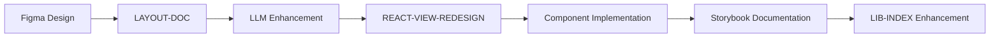

# 🎨 Optional & Designer-Led Artifacts

## Purpose
Document optional artifacts that are typically created by designers or through specialized tools, with guidance for LLM enhancement and integration.

## Overview

These artifacts are generally **not generated by LLM agents** but can be enhanced or annotated by LLMs after initial creation by human designers or automated tools.

## Optional Artifacts

### 1. LAYOUT-DOC (Visual Design Documentation)

#### Source
- **Primary**: Manual creation using Figma, Sketch, Adobe XD
- **Secondary**: Design system tools like Storybook

#### LLM Enhancement Opportunities
```markdown
## Prompt: `Design Annotation Agent`

### Role
You are a Design Documentation Agent that enhances visual designs with technical annotations and implementation guidance.

### Input
- Figma/Sketch design files (exported as images or design tokens)
- Design system specifications
- Component library documentation
- UXSMD (UX Site Map Document) for context

### Output
Enhanced LAYOUT-DOC with:
- Technical implementation notes
- Component mapping to design system
- Responsive behavior specifications
- Accessibility annotations
- Developer handoff documentation

### Enhancement Template
```markdown
# LAYOUT-DOC: {Page/Component Name}
**Source**: Figma Design File - {URL}
**Designer**: {Designer Name}
**Date**: {YYYY-MM-DD}

## Design Overview
{LLM-generated description of the design intent and user experience}

## Component Breakdown
### Header Component
- **Design System Component**: `Header`
- **Variant**: `admin-header`
- **Props**: `{ user, notifications, tenantName }`
- **Responsive Behavior**: Collapses to hamburger menu on mobile
- **Accessibility**: ARIA navigation landmark, keyboard navigation

### Data Table Component  
- **Design System Component**: `DataTable`
- **Variant**: `client-table`
- **Props**: `{ data, columns, actions, pagination }`
- **Responsive Behavior**: Horizontal scroll on mobile, stack on small screens
- **Accessibility**: Sortable headers, row selection, screen reader support

## Implementation Notes
- Use CSS Grid for main layout structure
- Implement sticky header for table scrolling
- Ensure 4.5:1 color contrast ratio for all text
- Include focus indicators for keyboard navigation

## Design Tokens
```css
/* Colors */
--primary-color: #2563eb;
--secondary-color: #64748b;
--success-color: #059669;
--error-color: #dc2626;

/* Typography */
--font-family-primary: 'Inter', sans-serif;
--font-size-base: 16px;
--line-height-base: 1.5;

/* Spacing */
--spacing-xs: 4px;
--spacing-sm: 8px;
--spacing-md: 16px;
--spacing-lg: 24px;
--spacing-xl: 32px;
```

## Responsive Breakpoints
- Mobile: 320px - 767px
- Tablet: 768px - 1023px  
- Desktop: 1024px+

## Animation Specifications
- Page transitions: 200ms ease-in-out
- Hover states: 150ms ease
- Loading states: Skeleton animation, 1.5s duration
```

#### Integration with Development
- Maps to REACT-VIEW component specifications
- Provides visual validation for implemented components
- Guides styling and responsive behavior
- Ensures design system consistency

### 2. LIB-INDEX (Component Library Documentation)

#### Source
- **Primary**: Storybook auto-generation
- **Secondary**: Chromatic visual testing
- **Tertiary**: Custom documentation tools

#### LLM Enhancement Opportunities
```markdown
## Prompt: `Component Library Agent`

### Role
You are a Component Library Documentation Agent that enhances auto-generated component documentation with usage examples and best practices.

### Input
- Storybook component stories
- Component TypeScript interfaces
- Design system guidelines
- Usage analytics (if available)

### Output
Enhanced LIB-INDEX with:
- Comprehensive usage examples
- Best practice guidelines
- Common patterns and anti-patterns
- Integration examples with real data

### Enhancement Template
```markdown
# Component Library Index

## Core Components

### Button Component
**File**: `src/components/Button/Button.tsx`
**Storybook**: [View Stories](http://localhost:6006/?path=/story/button)

#### Usage Examples
```typescript
// Primary action button
<Button variant="primary" size="md" onClick={handleSubmit}>
  Save Client
</Button>

// Secondary action with icon
<Button variant="secondary" size="sm" icon="edit">
  Edit
</Button>

// Danger action with confirmation
<Button 
  variant="danger" 
  size="md" 
  onClick={handleDelete}
  confirmMessage="Are you sure you want to delete this client?"
>
  Delete
</Button>
```

#### Best Practices
- Use `primary` variant sparingly (max 1 per page)
- Always provide meaningful button text (avoid "Click here")
- Include loading states for async actions
- Use appropriate size for context (sm for tables, md for forms)

#### Common Patterns
```typescript
// Form submission pattern
const [isSubmitting, setIsSubmitting] = useState(false);

<Button 
  variant="primary" 
  type="submit" 
  loading={isSubmitting}
  disabled={!isFormValid}
>
  {isSubmitting ? 'Saving...' : 'Save Client'}
</Button>

// Bulk action pattern
<Button 
  variant="secondary" 
  disabled={selectedItems.length === 0}
  onClick={handleBulkAction}
>
  Delete Selected ({selectedItems.length})
</Button>
```

#### Anti-Patterns
- ❌ Don't use multiple primary buttons on the same page
- ❌ Don't use buttons for navigation (use Link component)
- ❌ Don't omit loading states for async actions
- ❌ Don't use generic text like "Submit" or "OK"

### DataTable Component
**File**: `src/components/DataTable/DataTable.tsx`
**Storybook**: [View Stories](http://localhost:6006/?path=/story/datatable)

#### Real-World Integration
```typescript
// Client management table
const ClientTable = () => {
  const { data: clients, isLoading } = useGetClientsQuery();
  
  const columns = [
    {
      key: 'companyName',
      label: 'Company',
      sortable: true,
      render: (client) => (
        <Link to={`/clients/${client.id}`}>
          {client.companyName}
        </Link>
      )
    },
    {
      key: 'contactEmail',
      label: 'Email',
      render: (client) => (
        <a href={`mailto:${client.contactEmail}`}>
          {client.contactEmail}
        </a>
      )
    },
    {
      key: 'actions',
      label: 'Actions',
      render: (client) => (
        <ButtonGroup>
          <Button size="sm" variant="outline" icon="edit">
            Edit
          </Button>
          <Button size="sm" variant="danger" icon="trash">
            Delete
          </Button>
        </ButtonGroup>
      )
    }
  ];

  return (
    <DataTable
      data={clients}
      columns={columns}
      loading={isLoading}
      pagination
      searchable
      selectable
    />
  );
};
```
```

#### Auto-Generation Integration
```javascript
// .storybook/main.js enhancement
module.exports = {
  stories: ['../src/**/*.stories.@(js|jsx|ts|tsx|mdx)'],
  addons: [
    '@storybook/addon-docs',
    '@storybook/addon-controls',
    '@storybook/addon-a11y',
    // Custom addon for LLM enhancement
    './addons/llm-documentation-addon'
  ]
};

// Custom addon for LLM-enhanced documentation
// .storybook/addons/llm-documentation-addon.js
import { addons } from '@storybook/addons';
import { STORY_RENDERED } from '@storybook/core-events';

addons.register('llm-docs', (api) => {
  api.on(STORY_RENDERED, (storyId) => {
    // Enhance story documentation with LLM-generated content
    enhanceStoryDocumentation(storyId);
  });
});
```

### 3. REACT-VIEW-REDESIGN (Styled Components)

#### Source
- **Primary**: LAYOUT-DOC + Developer implementation
- **Secondary**: Design system evolution
- **Tertiary**: User feedback and testing

#### LLM Enhancement Opportunities
```markdown
## Prompt: `Style Enhancement Agent`

### Role
You are a Style Enhancement Agent that bridges design specifications with React component implementations, ensuring design system consistency and accessibility.

### Input
- LAYOUT-DOC (Visual Design Documentation)
- REACT-VIEW (Component Specifications)
- Design system tokens and guidelines
- Accessibility requirements

### Output
Enhanced REACT-VIEW-REDESIGN with:
- Styled-components implementations
- Design system integration
- Accessibility enhancements
- Performance optimizations

### Enhancement Template
```typescript
// ClientTable.styled.ts
// Enhanced styling based on LAYOUT-DOC specifications

import styled, { css } from 'styled-components';
import { DataTable } from '../DataTable';

// Design tokens from design system
const tokens = {
  colors: {
    primary: '#2563eb',
    secondary: '#64748b',
    success: '#059669',
    error: '#dc2626',
    background: '#ffffff',
    surface: '#f8fafc',
    border: '#e2e8f0'
  },
  spacing: {
    xs: '4px',
    sm: '8px',
    md: '16px',
    lg: '24px',
    xl: '32px'
  },
  typography: {
    fontFamily: "'Inter', sans-serif",
    fontSize: {
      sm: '14px',
      md: '16px',
      lg: '18px'
    },
    lineHeight: {
      tight: '1.25',
      normal: '1.5',
      relaxed: '1.75'
    }
  },
  breakpoints: {
    mobile: '768px',
    tablet: '1024px',
    desktop: '1200px'
  }
};

// Styled table container with responsive behavior
export const StyledTableContainer = styled.div`
  background: ${tokens.colors.background};
  border-radius: 8px;
  border: 1px solid ${tokens.colors.border};
  overflow: hidden;
  box-shadow: 0 1px 3px 0 rgba(0, 0, 0, 0.1);

  @media (max-width: ${tokens.breakpoints.mobile}) {
    border-radius: 0;
    border-left: none;
    border-right: none;
  }
`;

// Enhanced table with accessibility features
export const StyledTable = styled(DataTable)`
  width: 100%;
  
  /* Ensure proper focus indicators */
  th, td {
    &:focus-within {
      outline: 2px solid ${tokens.colors.primary};
      outline-offset: -2px;
    }
  }

  /* Sticky header for long tables */
  thead th {
    position: sticky;
    top: 0;
    background: ${tokens.colors.surface};
    z-index: 10;
    border-bottom: 2px solid ${tokens.colors.border};
  }

  /* Responsive table behavior */
  @media (max-width: ${tokens.breakpoints.mobile}) {
    /* Stack table cells on mobile */
    thead {
      display: none;
    }
    
    tbody tr {
      display: block;
      border: 1px solid ${tokens.colors.border};
      margin-bottom: ${tokens.spacing.md};
      border-radius: 4px;
    }
    
    tbody td {
      display: block;
      text-align: right;
      padding: ${tokens.spacing.sm} ${tokens.spacing.md};
      border: none;
      
      &:before {
        content: attr(data-label) ': ';
        float: left;
        font-weight: 600;
        color: ${tokens.colors.secondary};
      }
    }
  }
`;

// Status badge with semantic colors
export const StatusBadge = styled.span<{ status: 'active' | 'inactive' }>`
  display: inline-flex;
  align-items: center;
  padding: ${tokens.spacing.xs} ${tokens.spacing.sm};
  border-radius: 12px;
  font-size: ${tokens.typography.fontSize.sm};
  font-weight: 500;
  
  ${({ status }) => {
    switch (status) {
      case 'active':
        return css`
          background: rgba(5, 150, 105, 0.1);
          color: ${tokens.colors.success};
        `;
      case 'inactive':
        return css`
          background: rgba(100, 116, 139, 0.1);
          color: ${tokens.colors.secondary};
        `;
      default:
        return css`
          background: ${tokens.colors.surface};
          color: ${tokens.colors.secondary};
        `;
    }
  }}
`;

// Action button group with proper spacing
export const ActionButtonGroup = styled.div`
  display: flex;
  gap: ${tokens.spacing.xs};
  
  /* Ensure buttons don't wrap on small screens */
  flex-wrap: nowrap;
  
  /* Hide secondary actions on very small screens */
  @media (max-width: 480px) {
    .secondary-action {
      display: none;
    }
  }
`;
```

#### Performance Optimizations
```typescript
// Memoized table row component
export const TableRow = React.memo<TableRowProps>(({ 
  client, 
  onEdit, 
  onDelete 
}) => {
  const handleEdit = useCallback(() => onEdit(client.id), [client.id, onEdit]);
  const handleDelete = useCallback(() => onDelete(client.id), [client.id, onDelete]);
  
  return (
    <tr>
      <td data-label="Company">{client.companyName}</td>
      <td data-label="Email">{client.contactEmail}</td>
      <td data-label="Status">
        <StatusBadge status={client.isActive ? 'active' : 'inactive'}>
          {client.isActive ? 'Active' : 'Inactive'}
        </StatusBadge>
      </td>
      <td data-label="Actions">
        <ActionButtonGroup>
          <Button size="sm" variant="outline" onClick={handleEdit}>
            Edit
          </Button>
          <Button 
            size="sm" 
            variant="danger" 
            onClick={handleDelete}
            className="secondary-action"
          >
            Delete
          </Button>
        </ActionButtonGroup>
      </td>
    </tr>
  );
});
```
```

## Integration Strategy

### 1. Design-to-Code Workflow


### 2. Quality Assurance
- **Design Review**: Ensure implementation matches design intent
- **Accessibility Audit**: Verify WCAG 2.1 AA compliance
- **Performance Testing**: Validate component performance
- **Cross-Browser Testing**: Ensure compatibility
- **Responsive Testing**: Verify behavior across devices

### 3. Maintenance Strategy
- **Design System Updates**: Propagate token changes
- **Component Evolution**: Track usage and feedback
- **Documentation Sync**: Keep docs current with implementation
- **Accessibility Updates**: Regular accessibility reviews

## Usage Guidelines

### When to Use LLM Enhancement
- ✅ **Technical annotation** of visual designs
- ✅ **Documentation enhancement** of auto-generated content
- ✅ **Best practice guidance** for component usage
- ✅ **Accessibility improvement** suggestions
- ✅ **Performance optimization** recommendations

### When to Use Manual Creation
- ✅ **Visual design creation** (Figma, Sketch)
- ✅ **Brand and aesthetic decisions**
- ✅ **User research and testing**
- ✅ **Creative problem solving**
- ✅ **Strategic design decisions**

### Integration Points
- **LAYOUT-DOC** ↔ **REACT-VIEW**: Visual design to component mapping
- **LIB-INDEX** ↔ **REACT-STORE**: Component usage to state management
- **REACT-VIEW-REDESIGN** ↔ **TEST-PLAN**: Styled components to visual testing

## Output Format

### File Structure
```
Requirements/
├── design/
│   ├── LAYOUT-DOC.md
│   ├── design-tokens.json
│   └── component-specs/
├── frontend/
│   ├── LIB-INDEX.md
│   ├── REACT-VIEW-REDESIGN.md
│   └── styled-components/
└── cross-cutting/
    ├── RTM.csv
    └── requirements_tracker.json
```

## Summary

Optional artifacts bridge the gap between design and development, providing enhanced documentation and implementation guidance. While primarily created by designers and tools, LLM enhancement adds significant value through:

- **Technical annotations** that help developers understand design intent
- **Implementation guidance** that ensures consistency and quality
- **Best practice documentation** that improves team efficiency
- **Accessibility enhancements** that ensure inclusive design
- **Performance optimizations** that maintain system quality

These artifacts complement the core requirement documents and provide the final layer of implementation detail needed for successful project delivery.
```