# Master Technical Architecture Document
## Enterprise Logistics and Payment Platform

### Document Information
- **Document Type**: Master Technical Architecture Document
- **Version**: 1.0
- **Date**: June 2, 2025
- **Status**: Final
- **Scope**: Complete enterprise platform technical architecture

---

## Executive Summary

### Architecture Vision
This document defines the comprehensive technical architecture for the enterprise logistics and payment platform, integrating four interconnected systems: Customer Payment Processing, Load Booking Management, Invoice Processing, and Notchify Carrier Payments into a unified, scalable, and secure platform.

### Architecture Principles
1. **Scalability**: Horizontally scalable architecture supporting 10x growth
2. **Reliability**: 99.9% uptime with automated failover and disaster recovery
3. **Security**: Enterprise-grade security with compliance (PCI DSS, SOX)
4. **Performance**: Sub-200ms API response times for optimal user experience
5. **Maintainability**: Clean, modular architecture with comprehensive documentation
6. **Flexibility**: Event-driven architecture enabling rapid feature development

## System Architecture Overview

### High-Level Architecture
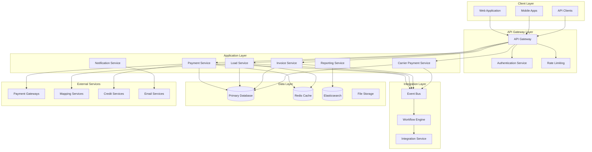

### Architecture Patterns
- **Microservices Architecture**: Independent, deployable services
- **Event-Driven Architecture**: Asynchronous communication between services
- **API-First Design**: All functionality exposed via well-documented APIs
- **CQRS Pattern**: Separate read and write operations for optimal performance
- **Circuit Breaker Pattern**: Fault tolerance and graceful degradation

## Technology Stack

### Backend Technologies

#### Application Framework
- **Primary**: Node.js with Express.js for rapid development and excellent ecosystem
- **Alternative**: Python with FastAPI for high-performance requirements
- **Rationale**: Node.js provides excellent performance for I/O intensive operations typical in logistics platforms

#### Database Technologies
- **Primary Database**: PostgreSQL 14+ for ACID compliance and robust feature set
- **Caching**: Redis 6+ for session management and application caching
- **Search**: Elasticsearch 8+ for advanced search and analytics
- **File Storage**: AWS S3 or Azure Blob Storage for document management

#### Message Queue and Event Processing
- **Message Broker**: Apache Kafka for high-throughput event streaming
- **Queue Management**: RabbitMQ for traditional queue operations
- **Event Store**: PostgreSQL with custom event sourcing implementation

#### Authentication and Security
- **Authentication**: OAuth 2.0 with JWT tokens
- **Authorization**: Role-Based Access Control (RBAC) with fine-grained permissions
- **Secret Management**: HashiCorp Vault for secure secret storage
- **Certificate Management**: Let's Encrypt with automated renewal

### Frontend Technologies

#### Web Application
- **Framework**: React 18+ with TypeScript for type safety and maintainability
- **State Management**: Redux Toolkit for complex state management
- **UI Library**: Material-UI (MUI) for consistent design system
- **Build Tool**: Vite for fast development and optimized builds

#### Mobile Applications
- **Framework**: React Native for cross-platform development
- **State Management**: Redux Toolkit (shared with web)
- **Navigation**: React Navigation 6+
- **Native Modules**: Custom native modules for platform-specific features

### Infrastructure Technologies

#### Cloud Platform
- **Primary**: Amazon Web Services (AWS) for comprehensive service offering
- **Container Orchestration**: Kubernetes (EKS) for scalable container management
- **Service Mesh**: Istio for advanced traffic management and security
- **Monitoring**: Prometheus + Grafana for metrics and alerting

#### CI/CD and DevOps
- **Version Control**: Git with GitHub for source code management
- **CI/CD**: GitHub Actions for automated testing and deployment
- **Infrastructure as Code**: Terraform for infrastructure management
- **Configuration Management**: Helm charts for Kubernetes deployments

## Detailed System Architecture

### 1. Customer Payment Processing Service

#### Service Architecture
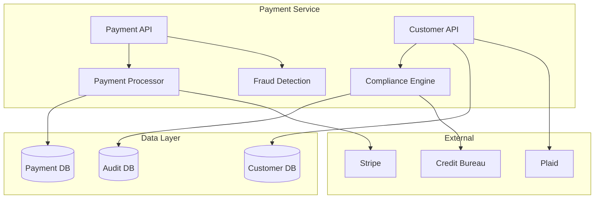

#### Key Components
- **Payment API**: RESTful API for payment processing operations
- **Customer API**: Customer management and onboarding functionality
- **Payment Processor**: Core payment processing logic with multiple gateway support
- **Fraud Detection**: Real-time fraud detection and risk assessment
- **Compliance Engine**: PCI DSS and regulatory compliance management

#### Data Model
```sql
-- Customer Management
CREATE TABLE customers (
    customer_id UUID PRIMARY KEY,
    company_name VARCHAR(255) NOT NULL,
    contact_name VARCHAR(255) NOT NULL,
    email VARCHAR(255) UNIQUE NOT NULL,
    phone VARCHAR(50),
    billing_address JSONB NOT NULL,
    shipping_address JSONB,
    credit_limit DECIMAL(12,2) DEFAULT 0.00,
    payment_terms VARCHAR(50) DEFAULT 'NET_30',
    status customer_status DEFAULT 'ACTIVE',
    created_at TIMESTAMP DEFAULT CURRENT_TIMESTAMP,
    updated_at TIMESTAMP DEFAULT CURRENT_TIMESTAMP
);

-- Payment Processing
CREATE TABLE payments (
    payment_id UUID PRIMARY KEY,
    customer_id UUID REFERENCES customers(customer_id),
    invoice_id UUID NOT NULL,
    amount DECIMAL(12,2) NOT NULL,
    currency CHAR(3) DEFAULT 'USD',
    status payment_status DEFAULT 'PENDING',
    payment_method_id UUID,
    gateway_transaction_id VARCHAR(255),
    processed_at TIMESTAMP,
    created_at TIMESTAMP DEFAULT CURRENT_TIMESTAMP
);
```

### 2. Load Booking Management Service

#### Service Architecture
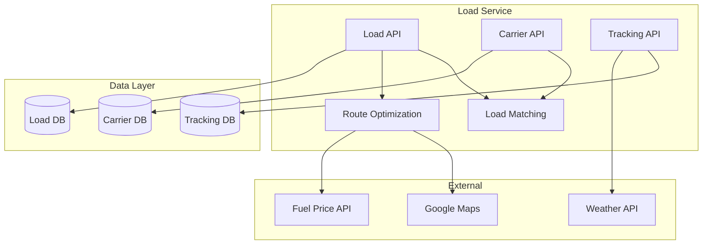

#### Key Components
- **Load API**: Load creation, management, and status tracking
- **Carrier API**: Carrier onboarding, management, and performance tracking
- **Tracking API**: Real-time location and status tracking
- **Matching Engine**: Intelligent carrier-load matching algorithm
- **Route Optimization**: AI-powered route and scheduling optimization

#### Data Model
```sql
-- Load Management
CREATE TABLE loads (
    load_id UUID PRIMARY KEY,
    customer_id UUID NOT NULL,
    carrier_id UUID,
    load_number VARCHAR(50) UNIQUE NOT NULL,
    origin_address JSONB NOT NULL,
    destination_address JSONB NOT NULL,
    cargo_details JSONB NOT NULL,
    weight DECIMAL(10,2),
    dimensions JSONB,
    equipment_type VARCHAR(50),
    rate DECIMAL(10,2),
    status load_status DEFAULT 'PENDING',
    pickup_date TIMESTAMP,
    delivery_date TIMESTAMP,
    created_at TIMESTAMP DEFAULT CURRENT_TIMESTAMP
);

-- Carrier Management
CREATE TABLE carriers (
    carrier_id UUID PRIMARY KEY,
    company_name VARCHAR(255) NOT NULL,
    contact_name VARCHAR(255) NOT NULL,
    email VARCHAR(255) UNIQUE NOT NULL,
    phone VARCHAR(50),
    mc_number VARCHAR(20) UNIQUE,
    dot_number VARCHAR(20) UNIQUE,
    insurance_info JSONB,
    equipment_types TEXT[],
    service_areas TEXT[],
    rating DECIMAL(3,2) DEFAULT 0.0,
    status carrier_status DEFAULT 'ACTIVE',
    created_at TIMESTAMP DEFAULT CURRENT_TIMESTAMP
);
```

### 3. Invoice Processing Service

#### Service Architecture
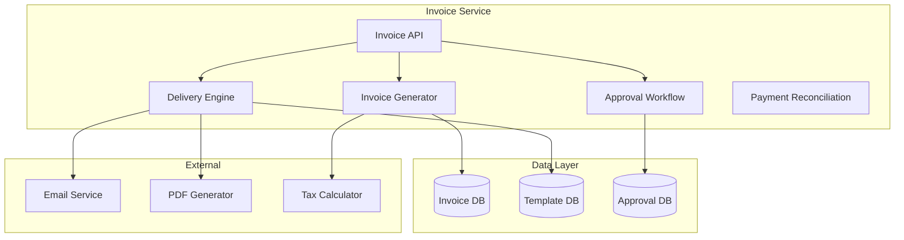

#### Key Components
- **Invoice API**: Invoice management and status tracking
- **Generation Engine**: Automated invoice creation from load data
- **Approval Engine**: Configurable multi-level approval workflows
- **Delivery Engine**: Multi-channel invoice delivery (email, portal, print)
- **Reconciliation**: Automated payment matching and reconciliation

#### Data Model
```sql
-- Invoice Management
CREATE TABLE invoices (
    invoice_id UUID PRIMARY KEY,
    customer_id UUID NOT NULL,
    load_id UUID NOT NULL,
    invoice_number VARCHAR(50) UNIQUE NOT NULL,
    line_items JSONB NOT NULL,
    subtotal DECIMAL(12,2) NOT NULL,
    tax_amount DECIMAL(12,2) DEFAULT 0.00,
    total DECIMAL(12,2) NOT NULL,
    status invoice_status DEFAULT 'DRAFT',
    due_date DATE NOT NULL,
    payment_received DECIMAL(12,2) DEFAULT 0.00,
    created_at TIMESTAMP DEFAULT CURRENT_TIMESTAMP,
    sent_at TIMESTAMP,
    paid_at TIMESTAMP
);

-- Approval Workflow
CREATE TABLE invoice_approvals (
    approval_id UUID PRIMARY KEY,
    invoice_id UUID REFERENCES invoices(invoice_id),
    approver_id UUID NOT NULL,
    approval_status approval_status DEFAULT 'PENDING',
    comments TEXT,
    approved_at TIMESTAMP,
    created_at TIMESTAMP DEFAULT CURRENT_TIMESTAMP
);
```

### 4. Notchify Carrier Payment Service

#### Service Architecture
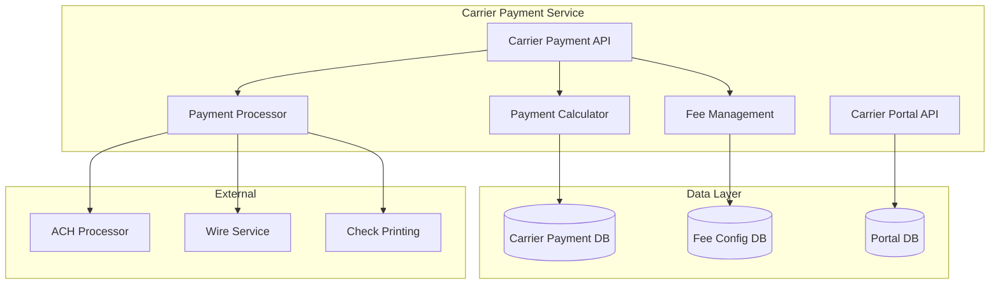

#### Key Components
- **Carrier Payment API**: Payment calculation and processing management
- **Calculation Engine**: Automated payment calculation with configurable rules
- **Fee Management**: Flexible fee structure configuration and application
- **Payment Processor**: Multi-method payment processing for carriers
- **Portal API**: Self-service portal for carriers to track payments

#### Data Model
```sql
-- Carrier Payment Management
CREATE TABLE carrier_payments (
    carrier_payment_id UUID PRIMARY KEY,
    carrier_id UUID NOT NULL,
    load_id UUID NOT NULL,
    payment_id UUID,
    base_amount DECIMAL(12,2) NOT NULL,
    fees JSONB DEFAULT '[]'::jsonb,
    total_amount DECIMAL(12,2) NOT NULL,
    currency CHAR(3) DEFAULT 'USD',
    status carrier_payment_status DEFAULT 'PENDING',
    payment_method VARCHAR(50),
    scheduled_date DATE,
    processed_at TIMESTAMP,
    created_at TIMESTAMP DEFAULT CURRENT_TIMESTAMP
);

-- Fee Structure
CREATE TABLE fee_types (
    fee_type_id UUID PRIMARY KEY,
    fee_code VARCHAR(50) UNIQUE NOT NULL,
    fee_name VARCHAR(255) NOT NULL,
    calculation_method fee_calculation_method NOT NULL,
    default_amount DECIMAL(10,2),
    default_percentage DECIMAL(5,4),
    is_active BOOLEAN DEFAULT TRUE,
    created_at TIMESTAMP DEFAULT CURRENT_TIMESTAMP
);
```

## Integration Architecture

### Event-Driven Architecture

#### Event Bus Design
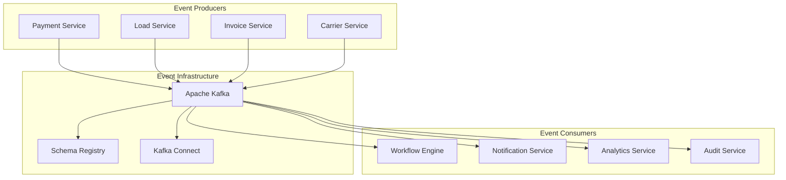

#### Event Schema Design
```json
{
  "namespace": "com.logistics.events",
  "type": "record",
  "name": "PaymentCompletedEvent",
  "fields": [
    {"name": "eventId", "type": "string"},
    {"name": "eventType", "type": "string", "default": "payment.completed"},
    {"name": "timestamp", "type": "long"},
    {"name": "source", "type": "string"},
    {"name": "version", "type": "string", "default": "1.0"},
    {"name": "data", "type": {
      "type": "record",
      "name": "PaymentData",
      "fields": [
        {"name": "paymentId", "type": "string"},
        {"name": "customerId", "type": "string"},
        {"name": "invoiceId", "type": "string"},
        {"name": "amount", "type": "double"},
        {"name": "currency", "type": "string"},
        {"name": "paymentMethod", "type": "string"}
      ]
    }}
  ]
}
```

### API Gateway Architecture

#### Gateway Configuration
```yaml
apiVersion: v1
kind: ConfigMap
metadata:
  name: api-gateway-config
data:
  gateway.yaml: |
    routes:
      - path: /api/v1/payments/*
        service: payment-service
        methods: [GET, POST, PUT, DELETE]
        auth_required: true
        rate_limit: 1000/hour
        
      - path: /api/v1/loads/*
        service: load-service
        methods: [GET, POST, PUT, DELETE]
        auth_required: true
        rate_limit: 2000/hour
        
      - path: /api/v1/invoices/*
        service: invoice-service
        methods: [GET, POST, PUT, DELETE]
        auth_required: true
        rate_limit: 1500/hour
        
      - path: /api/v1/carrier-payments/*
        service: carrier-payment-service
        methods: [GET, POST, PUT, DELETE]
        auth_required: true
        rate_limit: 500/hour
```

## Security Architecture

### Security Framework
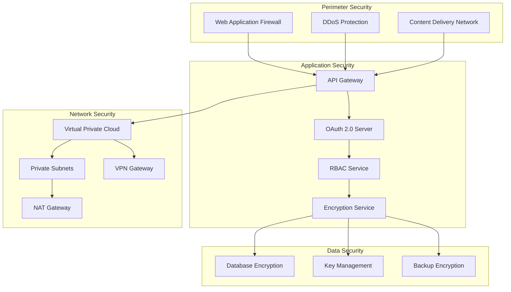

### Security Controls

#### Authentication and Authorization
- **Multi-Factor Authentication (MFA)**: Required for all administrative access
- **JWT Token Management**: Short-lived access tokens with refresh token rotation
- **Role-Based Access Control**: Fine-grained permissions based on user roles
- **API Key Management**: Secure API key generation and rotation

#### Data Protection
- **Encryption at Rest**: AES-256 encryption for all sensitive data
- **Encryption in Transit**: TLS 1.3 for all communications
- **Key Management**: Hardware Security Modules (HSM) for key storage
- **Data Masking**: PII masking in non-production environments

#### Compliance Framework
- **PCI DSS Level 1**: Payment card industry compliance
- **SOX Compliance**: Financial reporting compliance
- **GDPR Compliance**: Data privacy and protection
- **SOC 2 Type II**: Security and availability controls

## Performance Architecture

### Caching Strategy
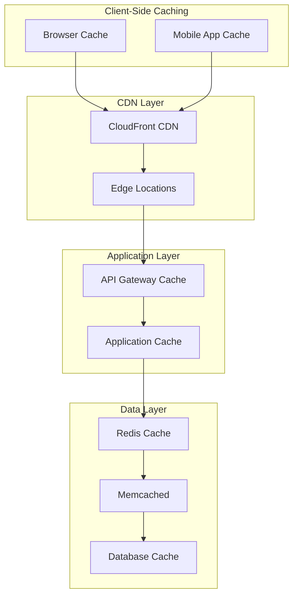

#### Caching Layers
1. **Browser/Mobile Cache**: Static assets and API responses (5-60 minutes)
2. **CDN Cache**: Global content distribution (1-24 hours)
3. **API Gateway Cache**: Frequently accessed API responses (1-15 minutes)
4. **Application Cache**: Business logic results (1-60 minutes)
5. **Redis Cache**: Session data and hot data (15 minutes - 24 hours)
6. **Database Cache**: Query result caching (5-30 minutes)

### Database Performance

#### Read Replicas and Sharding
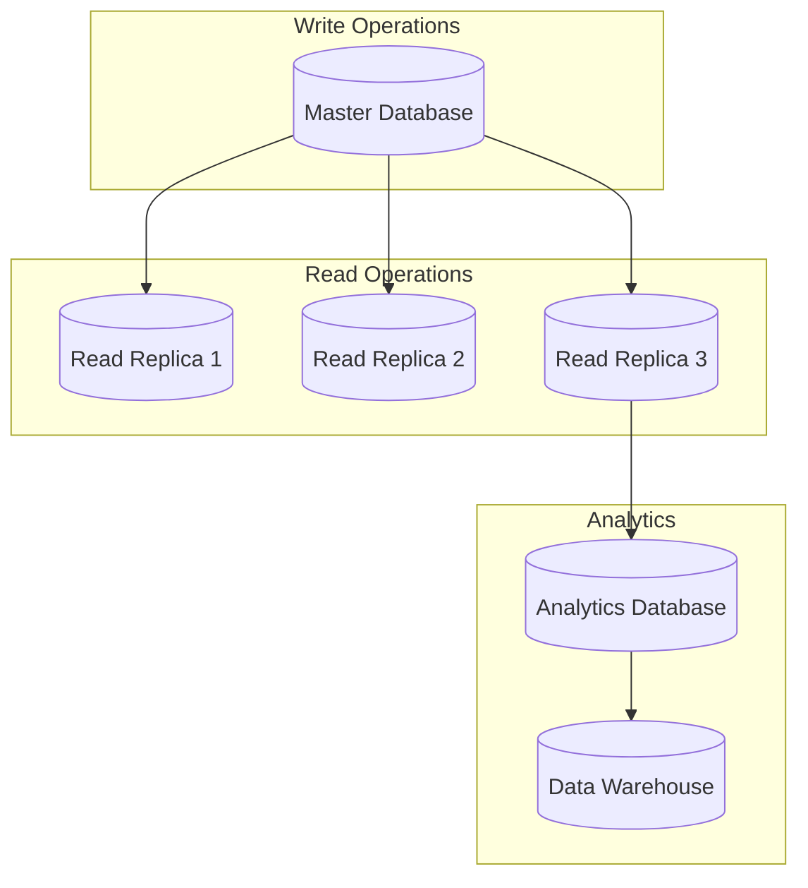

#### Performance Optimization
- **Connection Pooling**: PgBouncer for PostgreSQL connection management
- **Query Optimization**: Automated query performance monitoring
- **Index Strategy**: Composite indexes for complex queries
- **Partitioning**: Table partitioning for large datasets

## Deployment Architecture

### Kubernetes Deployment
```yaml
apiVersion: apps/v1
kind: Deployment
metadata:
  name: payment-service
spec:
  replicas: 3
  selector:
    matchLabels:
      app: payment-service
  template:
    metadata:
      labels:
        app: payment-service
    spec:
      containers:
      - name: payment-service
        image: logistics/payment-service:latest
        ports:
        - containerPort: 3000
        env:
        - name: DATABASE_URL
          valueFrom:
            secretKeyRef:
              name: db-secret
              key: url
        - name: REDIS_URL
          valueFrom:
            configMapKeyRef:
              name: redis-config
              key: url
        resources:
          requests:
            memory: "256Mi"
            cpu: "250m"
          limits:
            memory: "512Mi"
            cpu: "500m"
        livenessProbe:
          httpGet:
            path: /health
            port: 3000
          initialDelaySeconds: 30
          periodSeconds: 10
        readinessProbe:
          httpGet:
            path: /ready
            port: 3000
          initialDelaySeconds: 5
          periodSeconds: 5
```

### Infrastructure as Code
```hcl
# Terraform configuration for EKS cluster
resource "aws_eks_cluster" "logistics_cluster" {
  name     = "logistics-platform"
  role_arn = aws_iam_role.cluster_role.arn
  version  = "1.21"

  vpc_config {
    subnet_ids = [
      aws_subnet.private_subnet_1.id,
      aws_subnet.private_subnet_2.id,
      aws_subnet.public_subnet_1.id,
      aws_subnet.public_subnet_2.id,
    ]
    endpoint_private_access = true
    endpoint_public_access  = true
  }

  depends_on = [
    aws_iam_role_policy_attachment.cluster_policy,
    aws_iam_role_policy_attachment.service_policy,
  ]
}

resource "aws_eks_node_group" "logistics_nodes" {
  cluster_name    = aws_eks_cluster.logistics_cluster.name
  node_group_name = "logistics-nodes"
  node_role_arn   = aws_iam_role.node_role.arn
  subnet_ids      = [
    aws_subnet.private_subnet_1.id,
    aws_subnet.private_subnet_2.id,
  ]

  scaling_config {
    desired_size = 3
    max_size     = 10
    min_size     = 1
  }

  instance_types = ["t3.medium"]

  depends_on = [
    aws_iam_role_policy_attachment.node_policy,
    aws_iam_role_policy_attachment.cni_policy,
    aws_iam_role_policy_attachment.registry_policy,
  ]
}
```

## Monitoring and Observability

### Observability Stack
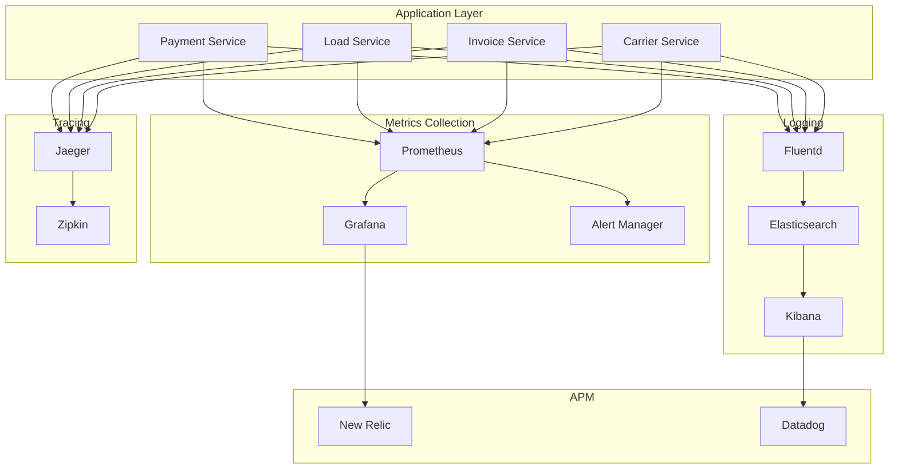

### Key Metrics and Alerts

#### Application Metrics
- **Request Rate**: Requests per second by service and endpoint
- **Response Time**: P50, P95, P99 latencies
- **Error Rate**: 4xx and 5xx error percentages
- **Throughput**: Transactions processed per minute

#### Infrastructure Metrics
- **CPU Utilization**: Average and peak CPU usage
- **Memory Usage**: Memory consumption and garbage collection
- **Disk I/O**: Read/write operations and latency
- **Network**: Bandwidth utilization and packet loss

#### Business Metrics
- **Load Completion Rate**: Percentage of loads completed on time
- **Payment Success Rate**: Successful payment processing percentage
- **Customer Satisfaction**: Average customer rating
- **Revenue Tracking**: Real-time revenue and growth metrics

## Disaster Recovery and Business Continuity

### Multi-Region Architecture
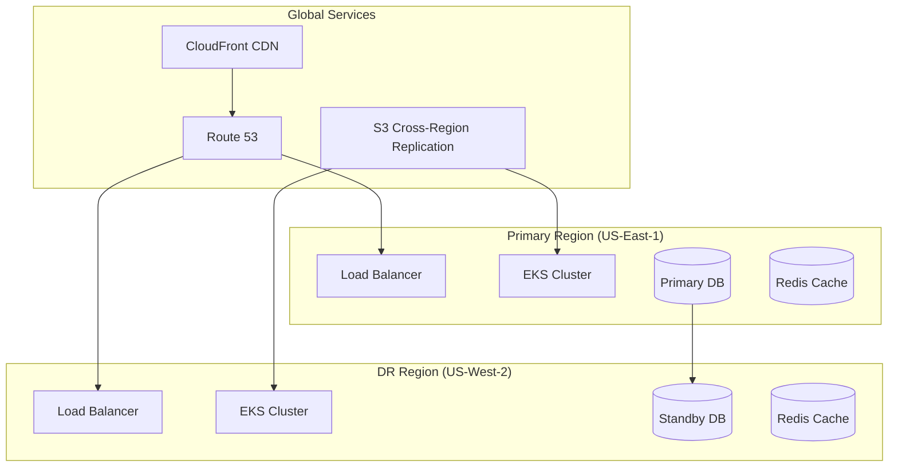

### Backup Strategy
- **Database Backups**: Automated daily backups with 30-day retention
- **Cross-Region Replication**: Real-time replication to DR region
- **Application Data**: Daily snapshots of application state
- **Configuration Backups**: Version-controlled infrastructure configurations

### Recovery Procedures
- **RTO (Recovery Time Objective)**: 4 hours for complete system recovery
- **RPO (Recovery Point Objective)**: 15 minutes maximum data loss
- **Automated Failover**: Automatic failover for database and critical services
- **Manual Failover**: Documented procedures for complex scenarios

## Development and Operations

### CI/CD Pipeline
```yaml
name: CI/CD Pipeline

on:
  push:
    branches: [main, develop]
  pull_request:
    branches: [main]

jobs:
  test:
    runs-on: ubuntu-latest
    steps:
    - uses: actions/checkout@v2
    - uses: actions/setup-node@v2
      with:
        node-version: '16'
    - run: npm ci
    - run: npm run lint
    - run: npm run test:unit
    - run: npm run test:integration
    - run: npm run security-scan

  build:
    needs: test
    runs-on: ubuntu-latest
    if: github.ref == 'refs/heads/main'
    steps:
    - uses: actions/checkout@v2
    - name: Build Docker image
      run: docker build -t logistics/payment-service:${{ github.sha }} .
    - name: Push to registry
      run: docker push logistics/payment-service:${{ github.sha }}
