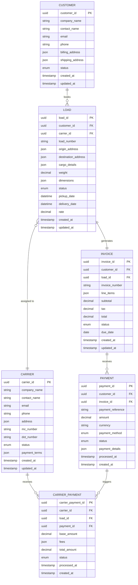

# Cross-System Data Model: Enterprise Data Architecture

## Executive Summary
This document defines a unified data model and data relationships across the four enterprise systems identified through video analysis, establishing consistent data entities, relationships, and governance for seamless data integration and consistency.

## Data Architecture Overview

### Core Business Entities
The enterprise data model is built around five core business entities that span across all systems:

1. **Customer**: The central entity representing clients using the services
2. **Load/Shipment**: Freight transportation requests and their lifecycle
3. **Invoice**: Financial documents for billing and payment processing
4. **Payment**: Financial transactions and payment processing records
5. **Carrier**: Transportation providers and their compensation

### Entity Relationship Diagram


## System-Specific Data Models

### 1. Customer Payment System Data Model

#### Core Tables
```sql
-- Customer Master Data
CREATE TABLE customers (
    customer_id UUID PRIMARY KEY DEFAULT gen_random_uuid(),
    company_name VARCHAR(255) NOT NULL,
    contact_name VARCHAR(255) NOT NULL,
    email VARCHAR(255) UNIQUE NOT NULL,
    phone VARCHAR(50),
    billing_address JSONB NOT NULL,
    shipping_address JSONB,
    credit_limit DECIMAL(12,2) DEFAULT 0.00,
    payment_terms VARCHAR(50) DEFAULT 'NET_30',
    status customer_status DEFAULT 'ACTIVE',
    created_at TIMESTAMP DEFAULT CURRENT_TIMESTAMP,
    updated_at TIMESTAMP DEFAULT CURRENT_TIMESTAMP
);

-- Payment Methods
CREATE TABLE payment_methods (
    payment_method_id UUID PRIMARY KEY DEFAULT gen_random_uuid(),
    customer_id UUID REFERENCES customers(customer_id),
    method_type payment_method_type NOT NULL,
    card_last_four VARCHAR(4),
    expiry_date DATE,
    is_default BOOLEAN DEFAULT FALSE,
    is_active BOOLEAN DEFAULT TRUE,
    created_at TIMESTAMP DEFAULT CURRENT_TIMESTAMP
);

-- Payment Transactions
CREATE TABLE payments (
    payment_id UUID PRIMARY KEY DEFAULT gen_random_uuid(),
    customer_id UUID REFERENCES customers(customer_id),
    invoice_id UUID NOT NULL,
    payment_method_id UUID REFERENCES payment_methods(payment_method_id),
    amount DECIMAL(12,2) NOT NULL,
    currency CHAR(3) DEFAULT 'USD',
    status payment_status DEFAULT 'PENDING',
    payment_reference VARCHAR(255),
    gateway_transaction_id VARCHAR(255),
    gateway_response JSONB,
    processed_at TIMESTAMP,
    created_at TIMESTAMP DEFAULT CURRENT_TIMESTAMP
);
```

#### Enums and Types
```sql
CREATE TYPE customer_status AS ENUM ('ACTIVE', 'INACTIVE', 'SUSPENDED');
CREATE TYPE payment_method_type AS ENUM ('CREDIT_CARD', 'ACH', 'WIRE_TRANSFER', 'CHECK');
CREATE TYPE payment_status AS ENUM ('PENDING', 'PROCESSING', 'COMPLETED', 'FAILED', 'REFUNDED');
```

### 2. Load Booking System Data Model

#### Core Tables
```sql
-- Load/Shipment Management
CREATE TABLE loads (
    load_id UUID PRIMARY KEY DEFAULT gen_random_uuid(),
    customer_id UUID NOT NULL,
    carrier_id UUID,
    load_number VARCHAR(50) UNIQUE NOT NULL,
    origin_address JSONB NOT NULL,
    destination_address JSONB NOT NULL,
    cargo_details JSONB NOT NULL,
    weight DECIMAL(10,2),
    dimensions JSONB,
    equipment_type VARCHAR(50),
    special_instructions TEXT,
    rate DECIMAL(10,2),
    status load_status DEFAULT 'PENDING',
    pickup_date TIMESTAMP,
    delivery_date TIMESTAMP,
    actual_pickup_date TIMESTAMP,
    actual_delivery_date TIMESTAMP,
    created_at TIMESTAMP DEFAULT CURRENT_TIMESTAMP,
    updated_at TIMESTAMP DEFAULT CURRENT_TIMESTAMP
);

-- Carrier Management
CREATE TABLE carriers (
    carrier_id UUID PRIMARY KEY DEFAULT gen_random_uuid(),
    company_name VARCHAR(255) NOT NULL,
    contact_name VARCHAR(255) NOT NULL,
    email VARCHAR(255) UNIQUE NOT NULL,
    phone VARCHAR(50),
    address JSONB NOT NULL,
    mc_number VARCHAR(20) UNIQUE,
    dot_number VARCHAR(20) UNIQUE,
    insurance_info JSONB,
    equipment_types TEXT[],
    service_areas TEXT[],
    rating DECIMAL(3,2) DEFAULT 0.0,
    status carrier_status DEFAULT 'ACTIVE',
    payment_terms JSONB,
    created_at TIMESTAMP DEFAULT CURRENT_TIMESTAMP,
    updated_at TIMESTAMP DEFAULT CURRENT_TIMESTAMP
);

-- Load Tracking
CREATE TABLE load_tracking (
    tracking_id UUID PRIMARY KEY DEFAULT gen_random_uuid(),
    load_id UUID REFERENCES loads(load_id),
    location JSONB,
    status VARCHAR(100),
    notes TEXT,
    timestamp TIMESTAMP DEFAULT CURRENT_TIMESTAMP
);
```

#### Enums and Types
```sql
CREATE TYPE load_status AS ENUM (
    'PENDING', 'ASSIGNED', 'DISPATCHED', 'PICKED_UP', 
    'IN_TRANSIT', 'DELIVERED', 'COMPLETED', 'CANCELLED'
);
CREATE TYPE carrier_status AS ENUM ('ACTIVE', 'INACTIVE', 'SUSPENDED', 'PENDING_APPROVAL');
```

### 3. Invoice Processing System Data Model

#### Core Tables
```sql
-- Invoice Management
CREATE TABLE invoices (
    invoice_id UUID PRIMARY KEY DEFAULT gen_random_uuid(),
    customer_id UUID NOT NULL,
    load_id UUID NOT NULL,
    invoice_number VARCHAR(50) UNIQUE NOT NULL,
    line_items JSONB NOT NULL,
    subtotal DECIMAL(12,2) NOT NULL,
    tax_rate DECIMAL(5,4) DEFAULT 0.0000,
    tax_amount DECIMAL(12,2) DEFAULT 0.00,
    total DECIMAL(12,2) NOT NULL,
    status invoice_status DEFAULT 'DRAFT',
    due_date DATE NOT NULL,
    payment_received DECIMAL(12,2) DEFAULT 0.00,
    notes TEXT,
    created_at TIMESTAMP DEFAULT CURRENT_TIMESTAMP,
    updated_at TIMESTAMP DEFAULT CURRENT_TIMESTAMP,
    sent_at TIMESTAMP,
    paid_at TIMESTAMP
);

-- Invoice Line Items (normalized)
CREATE TABLE invoice_line_items (
    line_item_id UUID PRIMARY KEY DEFAULT gen_random_uuid(),
    invoice_id UUID REFERENCES invoices(invoice_id),
    description VARCHAR(500) NOT NULL,
    quantity DECIMAL(10,3) DEFAULT 1.000,
    unit_price DECIMAL(10,2) NOT NULL,
    line_total DECIMAL(12,2) NOT NULL,
    tax_applicable BOOLEAN DEFAULT TRUE,
    line_order INTEGER NOT NULL
);

-- Invoice Approval Workflow
CREATE TABLE invoice_approvals (
    approval_id UUID PRIMARY KEY DEFAULT gen_random_uuid(),
    invoice_id UUID REFERENCES invoices(invoice_id),
    approver_id UUID NOT NULL,
    approval_status approval_status DEFAULT 'PENDING',
    comments TEXT,
    approved_at TIMESTAMP,
    created_at TIMESTAMP DEFAULT CURRENT_TIMESTAMP
);
```

#### Enums and Types
```sql
CREATE TYPE invoice_status AS ENUM (
    'DRAFT', 'PENDING_APPROVAL', 'APPROVED', 'SENT', 
    'PARTIALLY_PAID', 'PAID', 'OVERDUE', 'CANCELLED'
);
CREATE TYPE approval_status AS ENUM ('PENDING', 'APPROVED', 'REJECTED');
```

### 4. Notchify Carrier Payments System Data Model

#### Core Tables
```sql
-- Carrier Payment Management
CREATE TABLE carrier_payments (
    carrier_payment_id UUID PRIMARY KEY DEFAULT gen_random_uuid(),
    carrier_id UUID NOT NULL,
    load_id UUID NOT NULL,
    payment_id UUID, -- Reference to customer payment that triggered this
    base_amount DECIMAL(12,2) NOT NULL,
    fees JSONB DEFAULT '[]'::jsonb,
    total_amount DECIMAL(12,2) NOT NULL,
    currency CHAR(3) DEFAULT 'USD',
    status carrier_payment_status DEFAULT 'PENDING',
    payment_method VARCHAR(50),
    payment_reference VARCHAR(255),
    gateway_transaction_id VARCHAR(255),
    gateway_response JSONB,
    scheduled_date DATE,
    processed_at TIMESTAMP,
    created_at TIMESTAMP DEFAULT CURRENT_TIMESTAMP
);

-- Fee Structure Management
CREATE TABLE fee_types (
    fee_type_id UUID PRIMARY KEY DEFAULT gen_random_uuid(),
    fee_code VARCHAR(50) UNIQUE NOT NULL,
    fee_name VARCHAR(255) NOT NULL,
    fee_description TEXT,
    calculation_method fee_calculation_method NOT NULL,
    default_amount DECIMAL(10,2),
    default_percentage DECIMAL(5,4),
    is_active BOOLEAN DEFAULT TRUE,
    created_at TIMESTAMP DEFAULT CURRENT_TIMESTAMP
);

-- Carrier Payment Terms
CREATE TABLE carrier_payment_terms (
    terms_id UUID PRIMARY KEY DEFAULT gen_random_uuid(),
    carrier_id UUID NOT NULL,
    payment_schedule payment_schedule DEFAULT 'WEEKLY',
    minimum_threshold DECIMAL(10,2) DEFAULT 100.00,
    payment_method VARCHAR(50) DEFAULT 'ACH',
    bank_details JSONB,
    is_active BOOLEAN DEFAULT TRUE,
    created_at TIMESTAMP DEFAULT CURRENT_TIMESTAMP,
    updated_at TIMESTAMP DEFAULT CURRENT_TIMESTAMP
);
```

#### Enums and Types
```sql
CREATE TYPE carrier_payment_status AS ENUM (
    'PENDING', 'SCHEDULED', 'PROCESSING', 'COMPLETED', 'FAILED', 'CANCELLED'
);
CREATE TYPE fee_calculation_method AS ENUM ('FIXED_AMOUNT', 'PERCENTAGE', 'TIERED');
CREATE TYPE payment_schedule AS ENUM ('IMMEDIATE', 'DAILY', 'WEEKLY', 'MONTHLY');
```

## Data Synchronization Patterns

### Master Data Management
- **Customer Data**: Single source of truth in Customer Payment System
- **Carrier Data**: Single source of truth in Load Booking System
- **Load Data**: Single source of truth in Load Booking System
- **Financial Data**: Distributed across Invoice and Payment systems

### Data Flow Patterns

#### 1. Load Creation Flow
```
Load Booking System (Create Load) 
→ Invoice Processing System (Create Invoice Draft)
→ Customer Payment System (Create Payment Record)
→ Notchify System (Create Payment Schedule)
```

#### 2. Payment Processing Flow
```
Customer Payment System (Process Payment)
→ Invoice Processing System (Update Invoice Status)
→ Notchify System (Trigger Carrier Payment)
→ Load Booking System (Update Load Status)
```

#### 3. Data Synchronization Events
```json
{
  "event_type": "customer.updated",
  "source_system": "payment_system",
  "timestamp": "2025-06-02T21:00:00Z",
  "data": {
    "customer_id": "cust_123456",
    "changed_fields": ["contact_name", "email"],
    "new_values": {
      "contact_name": "John Smith",
      "email": "john.smith@company.com"
    }
  }
}
```

## Data Quality and Governance

### Data Validation Rules

#### Customer Data
- Email format validation and uniqueness
- Phone number format validation
- Address completeness validation
- Credit limit business rules

#### Load Data
- Origin and destination address validation
- Weight and dimension constraints
- Equipment type compatibility
- Rate validation against agreed terms

#### Financial Data
- Amount precision (2 decimal places)
- Currency code validation (ISO 4217)
- Payment method validation
- Due date business rules

### Data Integrity Constraints

#### Referential Integrity
```sql
-- Ensure all loads have valid customers
ALTER TABLE loads ADD CONSTRAINT fk_load_customer 
FOREIGN KEY (customer_id) REFERENCES customers(customer_id);

-- Ensure all invoices reference valid loads
ALTER TABLE invoices ADD CONSTRAINT fk_invoice_load 
FOREIGN KEY (load_id) REFERENCES loads(load_id);

-- Ensure all payments reference valid invoices
ALTER TABLE payments ADD CONSTRAINT fk_payment_invoice 
FOREIGN KEY (invoice_id) REFERENCES invoices(invoice_id);
```

#### Business Rule Constraints
```sql
-- Ensure payment amount doesn't exceed invoice total
ALTER TABLE payments ADD CONSTRAINT chk_payment_amount 
CHECK (amount > 0 AND amount <= (
    SELECT total FROM invoices WHERE invoices.invoice_id = payments.invoice_id
));

-- Ensure load pickup date is before delivery date
ALTER TABLE loads ADD CONSTRAINT chk_load_dates 
CHECK (pickup_date < delivery_date);
```

### Data Archival and Retention

#### Retention Policies
- **Active Customer Data**: Retain indefinitely while customer is active
- **Completed Loads**: Retain for 7 years for compliance
- **Invoices**: Retain for 7 years for tax purposes
- **Payments**: Retain for 7 years for financial auditing
- **Carrier Payments**: Retain for 7 years for tax compliance

#### Archival Strategy
```sql
-- Archive completed loads older than 2 years
CREATE TABLE loads_archive (LIKE loads INCLUDING ALL);

-- Automated archival process
CREATE OR REPLACE FUNCTION archive_old_loads() 
RETURNS INTEGER AS $$
DECLARE
    archived_count INTEGER;
BEGIN
    WITH archived_loads AS (
        DELETE FROM loads 
        WHERE status = 'COMPLETED' 
        AND created_at < CURRENT_DATE - INTERVAL '2 years'
        RETURNING *
    )
    INSERT INTO loads_archive SELECT * FROM archived_loads;
    
    GET DIAGNOSTICS archived_count = ROW_COUNT;
    RETURN archived_count;
END;
$$ LANGUAGE plpgsql;
```

## Data Security and Privacy

### Sensitive Data Identification
- **PII (Personally Identifiable Information)**: Customer contact details, carrier information
- **PCI (Payment Card Information)**: Credit card details, payment methods
- **Financial Data**: Payment amounts, invoice totals, carrier payment details
- **Business Sensitive**: Pricing, rates, carrier terms

### Encryption Strategy
```sql
-- Encrypt sensitive fields at rest
CREATE EXTENSION IF NOT EXISTS pgcrypto;

-- Encrypt credit card information
ALTER TABLE payment_methods 
ADD COLUMN encrypted_card_number BYTEA,
ADD COLUMN encrypted_cvv BYTEA;

-- Encrypt bank account details
ALTER TABLE carrier_payment_terms 
ALTER COLUMN bank_details TYPE BYTEA USING pgp_sym_encrypt(bank_details::text, 'encryption_key');
```

### Data Access Controls
- **Role-Based Access**: Different access levels for different user roles
- **Column-Level Security**: Sensitive columns restricted based on role
- **Row-Level Security**: Users can only access data they're authorized for
- **Audit Logging**: All data access and modifications logged

## Performance Optimization

### Indexing Strategy
```sql
-- Customer lookup optimization
CREATE INDEX idx_customers_email ON customers(email);
CREATE INDEX idx_customers_status ON customers(status);

-- Load queries optimization
CREATE INDEX idx_loads_customer_id ON loads(customer_id);
CREATE INDEX idx_loads_status_created ON loads(status, created_at);
CREATE INDEX idx_loads_pickup_date ON loads(pickup_date);

-- Invoice performance
CREATE INDEX idx_invoices_customer_status ON invoices(customer_id, status);
CREATE INDEX idx_invoices_due_date ON invoices(due_date) WHERE status IN ('SENT', 'PARTIALLY_PAID');

-- Payment optimization
CREATE INDEX idx_payments_customer_id ON payments(customer_id);
CREATE INDEX idx_payments_invoice_id ON payments(invoice_id);
CREATE INDEX idx_payments_status_processed ON payments(status, processed_at);
```

### Partitioning Strategy
```sql
-- Partition large tables by date
CREATE TABLE loads_partitioned (LIKE loads) PARTITION BY RANGE (created_at);
CREATE TABLE loads_2025 PARTITION OF loads_partitioned 
FOR VALUES FROM ('2025-01-01') TO ('2026-01-01');

-- Partition payments by month
CREATE TABLE payments_partitioned (LIKE payments) PARTITION BY RANGE (created_at);
CREATE TABLE payments_202506 PARTITION OF payments_partitioned 
FOR VALUES FROM ('2025-06-01') TO ('2025-07-01');
```

## Data Migration and Integration

### Migration Strategy
1. **Phase 1**: Establish data pipeline infrastructure
2. **Phase 2**: Migrate master data (customers, carriers)
3. **Phase 3**: Migrate transactional data (loads, invoices)
4. **Phase 4**: Migrate financial data (payments)
5. **Phase 5**: Implement real-time synchronization

### Data Transformation Mapping
```sql
-- Example transformation for legacy customer data
INSERT INTO customers (
    customer_id,
    company_name,
    contact_name,
    email,
    phone,
    billing_address,
    status
)
SELECT 
    gen_random_uuid(),
    TRIM(legacy.company_name),
    TRIM(legacy.contact_first_name || ' ' || legacy.contact_last_name),
    LOWER(TRIM(legacy.email_address)),
    legacy.phone_number,
    jsonb_build_object(
        'street', legacy.billing_street,
        'city', legacy.billing_city,
        'state', legacy.billing_state,
        'zip', legacy.billing_zip,
        'country', COALESCE(legacy.billing_country, 'US')
    ),
    CASE 
        WHEN legacy.is_active = 'Y' THEN 'ACTIVE'::customer_status
        ELSE 'INACTIVE'::customer_status
    END
FROM legacy_customers legacy
WHERE legacy.migrated_flag IS NULL;
```

## Monitoring and Observability

### Data Quality Metrics
- **Completeness**: Percentage of required fields populated
- **Accuracy**: Data validation rule compliance
- **Consistency**: Cross-system data alignment
- **Timeliness**: Data freshness and synchronization lag

### Data Health Dashboards
```sql
-- Data quality monitoring queries
SELECT 
    'customers' as table_name,
    COUNT(*) as total_records,
    COUNT(*) FILTER (WHERE email IS NOT NULL) as records_with_email,
    ROUND(COUNT(*) FILTER (WHERE email IS NOT NULL) * 100.0 / COUNT(*), 2) as email_completeness_pct
FROM customers

UNION ALL

SELECT 
    'loads' as table_name,
    COUNT(*) as total_records,
    COUNT(*) FILTER (WHERE carrier_id IS NOT NULL) as records_with_carrier,
    ROUND(COUNT(*) FILTER (WHERE carrier_id IS NOT NULL) * 100.0 / COUNT(*), 2) as carrier_assignment_pct
FROM loads;
```

---

**Document Status**: Version 1.0  
**Last Updated**: Generated from video analysis  
**Next Review**: After Notchify Carrier system analysis completion  
**Owner**: Data Architecture Team
