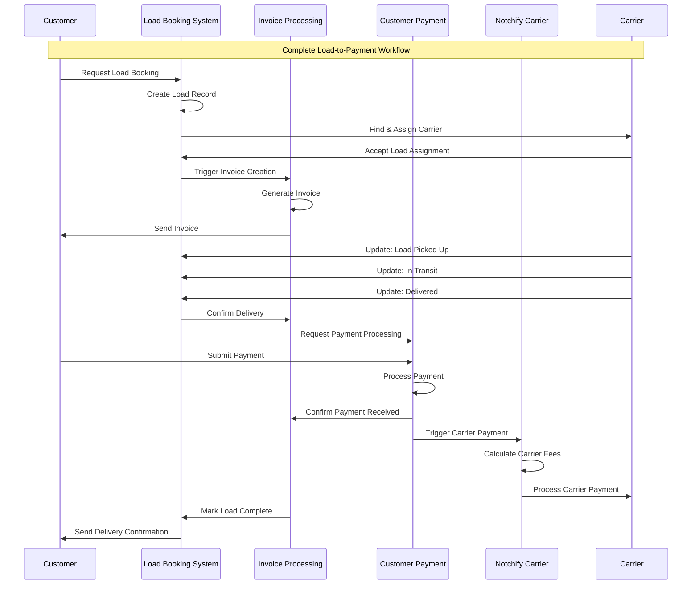
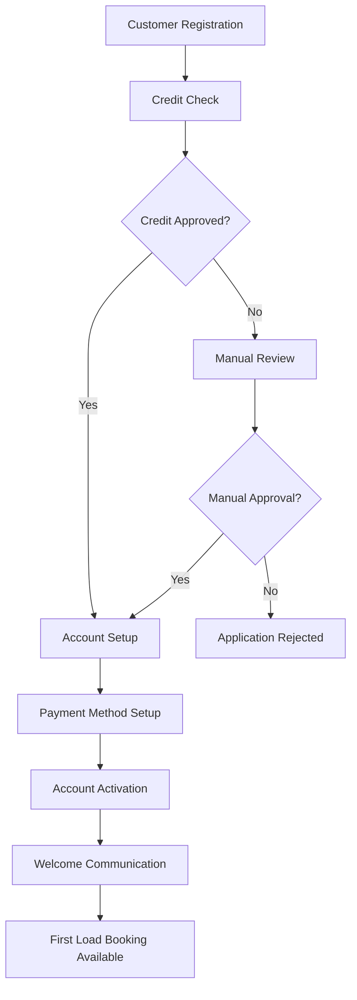
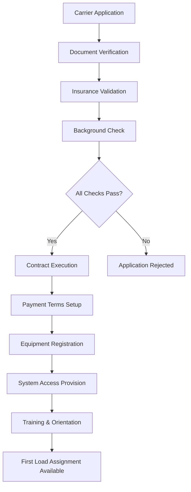
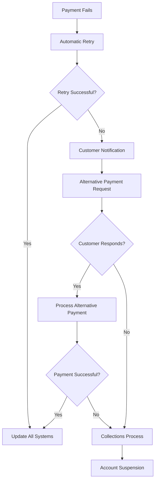
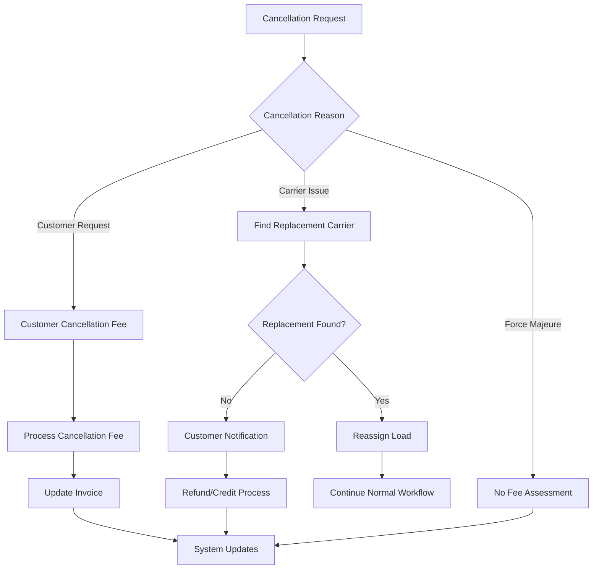
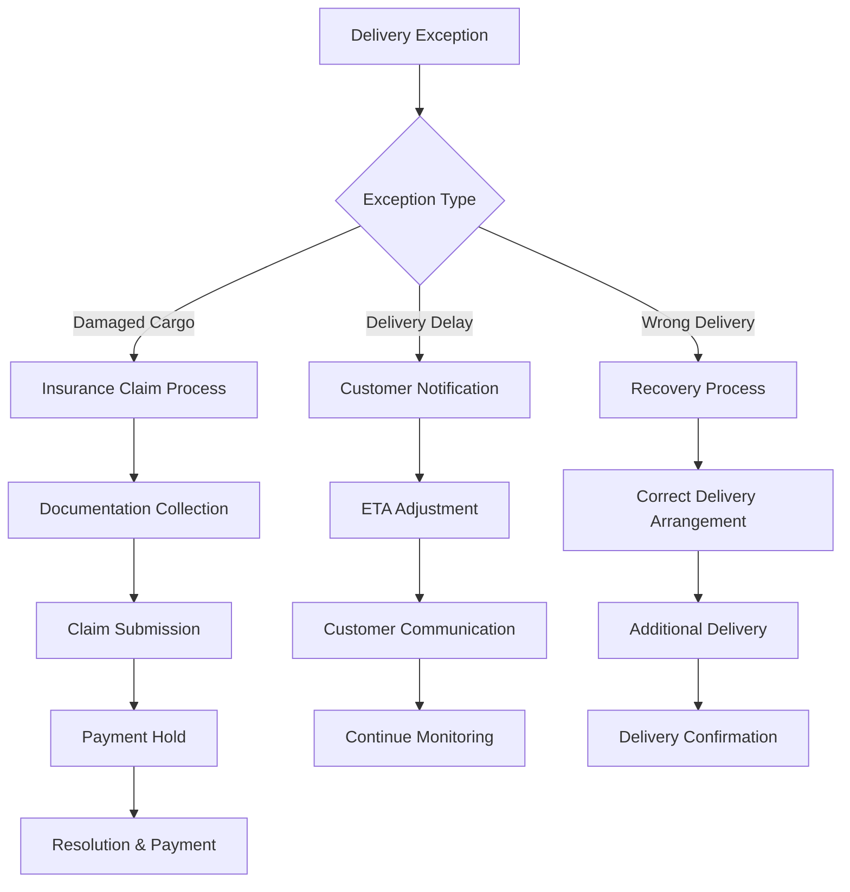

# End-to-End Workflows: Enterprise Business Process Integration

## Executive Summary
This document maps the complete end-to-end business workflows across the four enterprise systems, showing how customer requests flow through the entire logistics and payment ecosystem from initial load booking to final carrier payment.

## Primary Business Workflows

### 1. Complete Load-to-Payment Workflow

#### Overview
The primary business workflow encompasses the entire customer journey from load booking request to payment completion and carrier compensation.



#### Detailed Process Steps

##### Phase 1: Load Booking (Load Booking System)
1. **Customer Load Request**
   - Customer submits load details (origin, destination, cargo)
   - System validates addresses and cargo specifications
   - Load record created with unique identifier

2. **Carrier Assignment**
   - System searches available carriers by criteria
   - Rate negotiation and carrier selection
   - Load assignment confirmation

3. **Dispatch Confirmation**
   - Carrier accepts load assignment
   - Pickup and delivery schedules confirmed
   - Load status updated to "ASSIGNED"

##### Phase 2: Invoice Generation (Invoice Processing System)
1. **Automatic Invoice Creation**
   - Triggered by load assignment confirmation
   - Invoice generated based on agreed rates
   - Line items calculated (base rate, fuel surcharge, etc.)

2. **Invoice Approval Workflow**
   - Internal approval process if required
   - Rate validation and authorization
   - Invoice marked as "APPROVED"

3. **Customer Invoice Delivery**
   - Invoice sent via email or portal
   - Payment terms and due date specified
   - Invoice status updated to "SENT"

##### Phase 3: Load Execution (Load Booking System)
1. **Load Pickup**
   - Carrier arrives at pickup location
   - Cargo verification and documentation
   - Load status updated to "PICKED_UP"

2. **Transportation Tracking**
   - Real-time location updates
   - Status updates throughout transit
   - ETA updates and notifications

3. **Delivery Completion**
   - Cargo delivered to destination
   - Delivery confirmation and documentation
   - Load status updated to "DELIVERED"

##### Phase 4: Payment Processing (Customer Payment System)
1. **Customer Payment Submission**
   - Customer initiates payment via portal or system
   - Payment method validation and processing
   - Payment confirmation generated

2. **Payment Verification**
   - Transaction validation and fraud checking
   - Payment amount reconciliation with invoice
   - Payment status updated to "COMPLETED"

3. **Cross-System Notification**
   - Invoice system notified of payment
   - Load booking system updated
   - Carrier payment system triggered

##### Phase 5: Carrier Compensation (Notchify Carrier System)
1. **Payment Calculation**
   - Base carrier rate calculation
   - Fee adjustments (fuel, platform fees)
   - Total carrier payment amount determined

2. **Payment Processing**
   - Carrier payment method verification
   - Electronic payment processing (ACH, etc.)
   - Payment confirmation to carrier

3. **Completion Notification**
   - All systems updated with completion status
   - Final reconciliation and reporting
   - Workflow completion confirmation

### 2. Customer Onboarding Workflow

#### Process Flow


#### System Touchpoints
- **Customer Payment System**: Credit verification, payment method setup
- **Load Booking System**: Account profile creation, service preferences
- **Invoice Processing System**: Billing preferences, approval workflows
- **Cross-System**: Customer data synchronization

### 3. Carrier Onboarding Workflow

#### Process Flow


#### System Touchpoints
- **Load Booking System**: Carrier profile, equipment capabilities, service areas
- **Notchify Carrier System**: Payment preferences, banking details, fee structure
- **Cross-System**: Carrier data synchronization, compliance tracking

### 4. Exception Handling Workflows

#### 4.1 Payment Failure Workflow


#### 4.2 Load Cancellation Workflow


#### 4.3 Delivery Exception Workflow


## Data Flow Patterns

### 1. Real-Time Data Synchronization
- **Customer Updates**: Propagated across all systems immediately
- **Load Status Changes**: Real-time updates to tracking and invoicing
- **Payment Confirmations**: Immediate notification to all relevant systems

### 2. Batch Data Synchronization
- **Financial Reconciliation**: Daily batch processing for accounting
- **Reporting Data**: Nightly aggregation for business intelligence
- **Archive Processing**: Weekly cleanup and archival processes

### 3. Event-Driven Architecture
```json
{
  "workflow_events": [
    {
      "event": "load.created",
      "triggers": ["invoice.generate", "carrier.notify"],
      "data": "load_details"
    },
    {
      "event": "payment.completed",
      "triggers": ["invoice.mark_paid", "carrier_payment.schedule"],
      "data": "payment_details"
    },
    {
      "event": "delivery.confirmed",
      "triggers": ["invoice.finalize", "customer.notify"],
      "data": "delivery_details"
    }
  ]
}
```

## Performance Metrics and SLAs

### 1. End-to-End Workflow Performance

#### Customer-Facing SLAs
- **Load Booking Response**: <30 seconds
- **Invoice Generation**: <2 hours after load assignment
- **Payment Processing**: <5 minutes
- **Delivery Confirmation**: <1 hour after delivery

#### Internal Process SLAs
- **Carrier Assignment**: <24 hours
- **Invoice Approval**: <4 business hours
- **Carrier Payment**: <48 hours after customer payment
- **Exception Resolution**: <24 hours

### 2. System Integration Performance
- **API Response Times**: <200ms for 95% of requests
- **Data Synchronization Lag**: <30 seconds
- **Event Processing**: <5 seconds
- **Workflow Completion Rate**: >99.5%

## Business Rules and Validation

### 1. Cross-System Business Rules

#### Customer Validation Rules
- Credit limit enforcement across load booking and invoicing
- Payment history validation for new load requests
- Geographic service area validation

#### Load Validation Rules
- Carrier capacity and equipment type matching
- Route optimization and feasibility validation
- Rate validation against customer contracts

#### Financial Validation Rules
- Invoice amount validation against load rates
- Payment amount validation against invoice totals
- Carrier payment calculation validation

### 2. Workflow State Management

#### Load Lifecycle States
```
REQUESTED → QUOTED → BOOKED → ASSIGNED → DISPATCHED → 
PICKED_UP → IN_TRANSIT → DELIVERED → INVOICED → 
PAID → CARRIER_PAID → COMPLETED
```

#### Payment Lifecycle States
```
PENDING → PROCESSING → AUTHORIZED → CAPTURED → 
CONFIRMED → RECONCILED
```

#### Invoice Lifecycle States
```
DRAFT → APPROVED → SENT → VIEWED → PARTIAL_PAYMENT → 
PAID → CLOSED
```

## Error Handling and Recovery

### 1. System Failure Recovery

#### Graceful Degradation
- Non-critical system failures don't block core workflows
- Alternative processing paths for system outages
- Automatic failover to backup systems

#### Data Consistency Recovery
- Transaction rollback mechanisms
- Compensating transaction patterns
- Event replay capabilities for data recovery

### 2. Business Process Recovery

#### Workflow Interruption Handling
- State persistence for interrupted workflows
- Manual intervention capabilities
- Automatic retry mechanisms with exponential backoff

#### Exception Escalation
- Automated escalation for unresolved exceptions
- Management notification for critical failures
- Customer communication for service impacts

## Audit and Compliance

### 1. Audit Trail Requirements

#### Financial Audit Trails
- Complete payment processing audit logs
- Invoice generation and modification tracking
- Carrier payment calculation and processing logs

#### Operational Audit Trails
- Load booking and modification history
- Carrier assignment and performance tracking
- Customer interaction and communication logs

### 2. Compliance Monitoring

#### Regulatory Compliance
- DOT and FMCSA compliance tracking
- Financial services compliance (PCI DSS)
- Data privacy compliance (GDPR, CCPA)

#### Business Compliance
- Contract terms enforcement
- Service level agreement monitoring
- Quality assurance and performance tracking

## Continuous Improvement

### 1. Process Optimization

#### Workflow Analytics
- End-to-end process timing analysis
- Bottleneck identification and resolution
- Customer satisfaction correlation with process efficiency

#### Automation Opportunities
- Manual process identification for automation
- AI/ML integration for predictive insights
- Workflow optimization based on historical data

### 2. System Enhancement

#### Performance Improvements
- Database query optimization
- API response time improvements
- System capacity scaling

#### Feature Enhancements
- New workflow capabilities
- Enhanced integration patterns
- Improved user experience features

---

**Document Status**: Version 1.0  
**Last Updated**: Generated from video analysis  
**Next Review**: After Notchify Carrier system analysis completion  
**Owner**: Business Process Architecture Team
