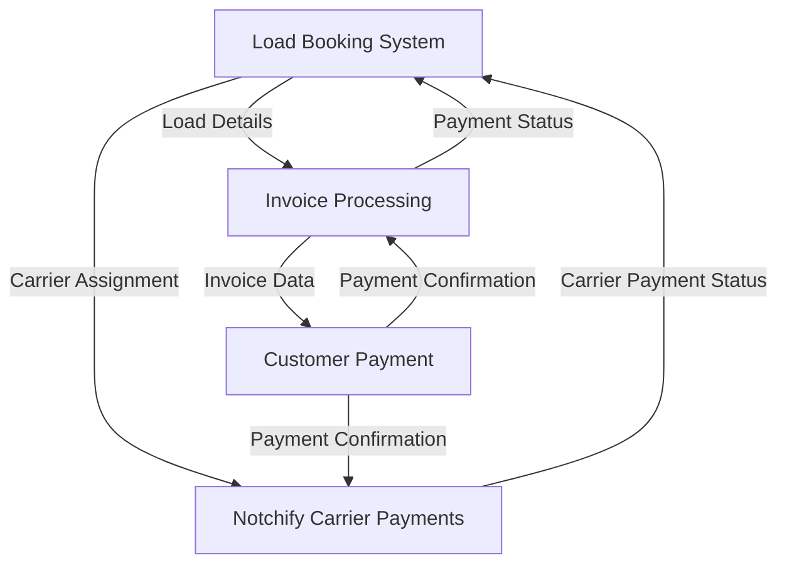

# Integration Matrix: Multi-System Enterprise Architecture

## Overview
This document maps the integration points and data flow between the four enterprise systems identified from video analysis:

1. **Customer Payment Process System** 
2. **Load Booking System (Logistics)**
3. **Invoice Processing System**
4. **Notchify Carrier Payments System** (pending completion)

## System Integration Matrix

| From System | To System | Integration Type | Data Exchanged | Frequency | Priority |
|-------------|-----------|------------------|----------------|-----------|----------|
| Load Booking | Invoice Processing | API Call | Load details, customer info, pricing | Per booking | High |
| Invoice Processing | Customer Payment | API Call | Invoice data, payment amounts | Per invoice | High |
| Customer Payment | Notchify Carrier | Webhook | Payment confirmations, carrier fees | Real-time | Medium |
| Load Booking | Notchify Carrier | API Call | Carrier assignments, load status | Per assignment | High |
| Invoice Processing | Load Booking | Status Update | Payment status, completion | Per payment | Medium |
| Customer Payment | Invoice Processing | Status Update | Payment confirmations | Real-time | High |

## Data Flow Architecture

## Shared Data Entities

### Core Business Entities
- **Customer**: Shared across Load Booking, Invoice Processing, Customer Payment
- **Load/Shipment**: Primary entity in Load Booking, referenced in Invoice and Carrier systems
- **Invoice**: Central to Invoice Processing, referenced in Customer Payment
- **Carrier**: Managed in Load Booking, paid through Notchify system
- **Payment**: Tracked in Customer Payment, affects Invoice Processing

### Integration Points

#### 1. Load Booking → Invoice Processing
- **Trigger**: Load completion/delivery confirmation
- **Data**: Load ID, customer details, service charges, delivery confirmation
- **Method**: REST API call
- **Response**: Invoice creation confirmation, invoice ID

#### 2. Invoice Processing → Customer Payment
- **Trigger**: Invoice generation
- **Data**: Invoice ID, amount due, customer payment details, due date
- **Method**: Event-driven notification + API
- **Response**: Payment processing initiation

#### 3. Customer Payment → Notchify Carrier
- **Trigger**: Customer payment received
- **Data**: Payment confirmation, carrier fee calculation
- **Method**: Webhook notification
- **Response**: Carrier payment queue update

#### 4. Load Booking → Notchify Carrier
- **Trigger**: Carrier assignment, load status updates
- **Data**: Carrier ID, load details, payment rate, completion status
- **Method**: API synchronization
- **Response**: Carrier payment schedule update

## API Standardization Requirements

### Common API Patterns
- RESTful design with consistent endpoint naming
- JSON payload format across all systems
- Standard HTTP status codes and error handling
- OAuth 2.0 authentication for inter-system communication
- Request/response logging for audit trails

### Shared Authentication
- Single Sign-On (SSO) integration
- Role-based access control (RBAC) across systems
- API key management for system-to-system communication

## Database Integration Strategy

### Shared Reference Data
- Customer master data
- Carrier information
- Geographic/location data
- Service type definitions

### Data Synchronization
- Real-time synchronization for critical business events
- Batch synchronization for reference data updates
- Conflict resolution strategies for concurrent updates

## Error Handling and Resilience

### Circuit Breaker Pattern
- Automatic failover when dependent systems are unavailable
- Graceful degradation of functionality
- Queue-based processing for non-critical integrations

### Data Consistency
- Eventual consistency model for non-critical data
- Strong consistency for financial transactions
- Compensating transaction patterns for rollback scenarios

## Monitoring and Observability

### Integration Metrics
- API call success/failure rates
- Response time monitoring
- Data synchronization lag
- Error rate tracking by integration point

### Alerting Strategy
- Critical integration failures (immediate notification)
- Performance degradation warnings
- Data consistency issues
- Security-related events

## Security Considerations

### Data in Transit
- TLS 1.3 encryption for all API communications
- Certificate-based authentication for system-to-system calls
- API rate limiting and throttling

### Data at Rest
- Encryption of sensitive customer and payment data
- Audit logging for all data access and modifications
- Compliance with PCI DSS for payment processing

## Implementation Roadmap

### Phase 1: Core Integrations (Weeks 1-4)
1. Load Booking → Invoice Processing integration
2. Invoice Processing → Customer Payment integration
3. Basic error handling and logging

### Phase 2: Carrier Payment Integration (Weeks 5-8)
1. Customer Payment → Notchify Carrier integration
2. Load Booking → Notchify Carrier integration
3. Advanced error handling and resilience patterns

### Phase 3: Optimization and Monitoring (Weeks 9-12)
1. Performance optimization
2. Advanced monitoring and alerting
3. Security hardening and compliance validation

## Testing Strategy

### Integration Testing
- End-to-end workflow testing across all systems
- API contract testing for interface compliance
- Performance testing under load conditions

### Data Validation
- Cross-system data consistency verification
- Business rule validation across integrations
- Financial calculation accuracy testing

## Maintenance and Governance

### API Versioning Strategy
- Semantic versioning for all APIs
- Backward compatibility maintenance
- Deprecation timeline management

### Documentation Maintenance
- Living documentation that evolves with system changes
- API documentation auto-generation
- Integration runbook maintenance

---

**Document Status**: Initial Version  
**Last Updated**: Generated from video analysis  
**Next Review**: After Notchify Carrier system analysis completion  
**Owner**: Enterprise Architecture Team
