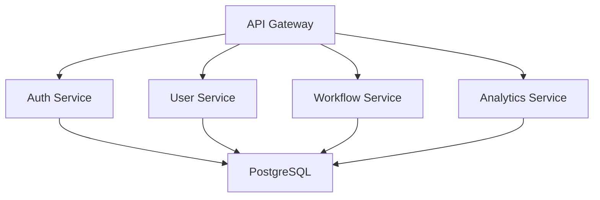

# Backend Requirements Document (BRD)
**Business Application Platform**
Version 1.0 | June 2, 2025

## 1. Overview (BRD-1)

### 1.1 Purpose
This document defines the backend architecture and technical requirements for implementing the Business Application Platform based on FRD specifications.

### 1.2 Scope
- Service architecture and APIs
- Business logic implementation
- Data models and persistence
- Security and authentication
- Integration patterns
- Performance requirements

### 1.3 Technical Stack
```
Frontend: React/TypeScript
Backend: Node.js/Express
Database: PostgreSQL
Authentication: JWT/OAuth2
API Style: REST
```

## 2. Service Architecture (BRD-2)

### 2.1 Component Overview


### 2.2 Service Responsibilities

| Service | Primary Responsibilities |
|---------|------------------------|
| API Gateway | Request routing, rate limiting, API documentation |
| Auth Service | Authentication, authorization, token management |
| User Service | User CRUD, role management, profiles |
| Workflow Service | Process automation, task management |
| Analytics Service | Reporting, metrics, data analysis |

## 3. Domain Services (BRD-3)

### 3.1 Auth Service (BRD-3.1)
```typescript
interface AuthService {
  authenticate(credentials: UserCredentials): Promise<AuthToken>;
  validateToken(token: string): Promise<TokenPayload>;
  refreshToken(token: string): Promise<AuthToken>;
  revokeToken(token: string): Promise<void>;
}
```

### 3.2 User Service (BRD-3.2)
```typescript
interface UserService {
  createUser(user: UserDTO): Promise<User>;
  assignRole(userId: string, roleId: string): Promise<void>;
  updatePermissions(roleId: string, permissions: Permission[]): Promise<void>;
  getUserProfile(userId: string): Promise<UserProfile>;
}
```

## 4. Business Logic (BRD-4)

### 4.1 Authentication Flow
1. Client submits credentials
2. Auth service validates credentials
3. Generate JWT token with user claims
4. Return token with refresh token
5. Store token metadata in database

### 4.2 Permission Management
- Role-based access control (RBAC)
- Hierarchical permission structure
- Permission inheritance
- Access audit logging

## 5. Workflow Specifications (BRD-5)

### 5.1 Process Automation
```typescript
interface WorkflowEngine {
  startProcess(definition: ProcessDefinition): Promise<ProcessInstance>;
  completeTask(taskId: string, data: any): Promise<void>;
  queryTasks(filter: TaskFilter): Promise<Task[]>;
}
```

### 5.2 State Management
- Process state persistence
- Transaction management
- Error handling and recovery
- State machine implementation

## 6. Integration Requirements (BRD-6)

### 6.1 External Systems
- REST API endpoints
- Message queue integration
- Webhook support
- File storage service

### 6.2 API Standards
- OpenAPI/Swagger documentation
- REST best practices
- Error handling patterns
- Rate limiting

## 7. Security Requirements (BRD-7)

### 7.1 Authentication
- JWT token-based auth
- OAuth2 support
- MFA capability
- Session management

### 7.2 Data Security
- Data encryption at rest
- TLS for data in transit
- Password hashing
- PII protection

## 8. Performance Requirements (BRD-8)

### 8.1 Service Level Objectives
| Metric | Target |
|--------|--------|
| API Response Time | < 200ms (p95) |
| System Availability | 99.9% |
| Concurrent Users | 10,000 |
| Request Rate | 1000 RPS |

### 8.2 Scalability
- Horizontal scaling capability
- Caching strategy
- Connection pooling
- Load balancing

## 9. Implementation Guidelines

### 9.1 Development Standards
- TypeScript for type safety
- Unit test coverage > 80%
- API versioning
- Error handling middleware

### 9.2 Deployment
- Docker containerization
- CI/CD pipeline
- Environment configuration
- Health monitoring

This BRD provides comprehensive technical specifications for implementing the backend services based on the FRD requirements. Development teams should refer to this document for architectural decisions and implementation details.