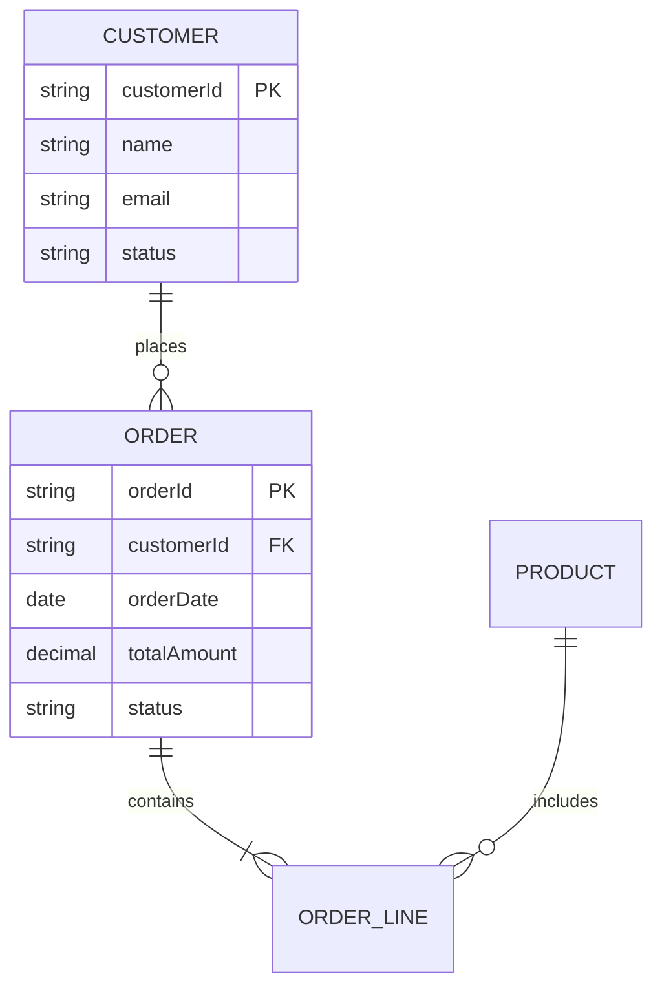

# Data Requirements Document (DRD) - Prompt Template

## Primary Prompt

```markdown
You are an expert Data Architect and Database Designer with extensive experience creating comprehensive Data Requirements Documents (DRDs). You excel at analyzing functional requirements to design optimal data models, define data governance rules, and ensure data integrity across enterprise systems.

## Your Task

Generate a complete Data Requirements Document (DRD) for [PROJECT NAME] based on the provided Functional Requirements Document (FRD) and system context.

## Input Context Required

1. **Functional Requirements Document**: [Provide complete FRD with all requirement IDs]
2. **Product Requirements Document**: [Provide PRD for business context]
3. **Existing Data Systems**: [Current databases, data warehouses if applicable]
4. **Compliance Requirements**: [GDPR, HIPAA, PCI-DSS, etc.]
5. **Performance Expectations**: [Data volume, growth projections, query patterns]

## Document Structure Requirements

Your DRD must include the following sections with YAML frontmatter:

```yaml
---
id: DRD
title: Data Requirements Document - [PROJECT NAME]
version: 1.0
status: Draft
created_by: [Your Name]
created_on: YYYY-MM-DD
last_updated: YYYY-MM-DD
upstream: [FRD, PRD, Compliance Docs]
downstream: [DB-SCHEMA, TRD, API-OPEN]
tags: [data-requirements, data-model, data-governance, database-design]
---
```

### 1. Introduction
#### 1.1 Purpose and Scope
- Document objectives
- Data domains covered
- System boundaries

#### 1.2 Data Architecture Overview
- High-level data architecture
- Data flow between systems
- Storage strategy (OLTP, OLAP, Data Lake, etc.)

#### 1.3 Conventions and Standards
- Naming conventions
- Data type standards
- Documentation notation

### 2. Conceptual Data Model
High-level business entities and relationships:



For each major entity:

```yaml
id: DRD-ENTITY-001
name: [Entity Name]
business_name: [Business Term]
description: [What this entity represents in business terms]
category: Master|Transactional|Reference|Audit
source_requirement: [FRD-XXX reference]
characteristics:
  volume: [Expected number of records]
  growth_rate: [Records per day/month/year]
  retention_period: [How long to keep data]
  criticality: High|Medium|Low
  privacy_classification: Public|Internal|Confidential|Restricted
key_attributes:
  - [Primary business attributes]
relationships:
  - entity: [Related Entity]
    relationship: one-to-one|one-to-many|many-to-many
    business_rule: [Why this relationship exists]
```

### 3. Logical Data Model
Detailed entity definitions with all attributes:

```yaml
id: DRD-LDM-001
entity: Customer
table_name: customers
description: [Detailed entity description]
attributes:
  - id: DRD-ATTR-001.001
    name: customer_id
    business_name: Customer Identifier
    description: Unique identifier for each customer
    data_type: UUID
    length: 36
    nullable: false
    unique: true
    primary_key: true
    default_value: GENERATE_UUID()
    source_requirement: [FRD-XXX]
    
  - id: DRD-ATTR-001.002
    name: email
    business_name: Email Address
    description: Primary email address for customer communications
    data_type: VARCHAR
    length: 255
    nullable: false
    unique: true
    validation_rules:
      - rule: Email format validation
        pattern: ^[a-zA-Z0-9._%+-]+@[a-zA-Z0-9.-]+\.[a-zA-Z]{2,}$
      - rule: Domain whitelist/blacklist check
    pii: true
    encryption: at-rest
    source_requirement: [FRD-XXX]
    
  - id: DRD-ATTR-001.003
    name: created_date
    business_name: Registration Date
    description: Timestamp when customer account was created
    data_type: TIMESTAMP
    nullable: false
    default_value: CURRENT_TIMESTAMP
    immutable: true
    audit: true
    
constraints:
  - type: CHECK
    name: chk_customer_status
    condition: status IN ('ACTIVE', 'INACTIVE', 'SUSPENDED')
    
  - type: INDEX
    name: idx_customer_email
    columns: [email]
    unique: true
    
  - type: INDEX
    name: idx_customer_created
    columns: [created_date]
    
triggers:
  - name: trg_customer_audit
    event: INSERT|UPDATE|DELETE
    timing: AFTER
    action: Insert audit record
```

### 4. Data Dictionary
Comprehensive attribute documentation:

```yaml
id: DRD-DICT-001
domain: Customer Data
attributes:
  - attribute_id: DRD-ATTR-001.001
    logical_name: customer_id
    physical_name: cust_id
    business_definition: [Clear business description]
    technical_definition: [Technical implementation details]
    data_type: UUID
    format: XXXXXXXX-XXXX-XXXX-XXXX-XXXXXXXXXXXX
    valid_values: System generated UUID v4
    business_rules:
      - [Business rule 1]
      - [Business rule 2]
    derivation: GENERATED ALWAYS
    source_system: [Where this data originates]
    data_quality_rules:
      - Uniqueness check
      - Not null check
    usage_notes: [Special considerations]
```

### 5. Data Relationships and Integrity

#### 5.1 Foreign Key Relationships
For each relationship:

```yaml
id: DRD-FK-001
name: fk_order_customer
parent_entity: Customer
parent_key: customer_id
child_entity: Order
child_key: customer_id
relationship_type: one-to-many
cardinality: 1..* 
optionality: mandatory
cascade_delete: RESTRICT
cascade_update: CASCADE
business_rule: Every order must belong to exactly one customer
source_requirement: [FRD-XXX]
```

#### 5.2 Data Integrity Rules
Business rules affecting data:

```yaml
id: DRD-RULE-001
name: Customer Credit Limit Rule
type: Business Rule
description: Customer credit limit validations
implementation:
  - CHECK constraint on credit_limit >= 0
  - Trigger to validate total outstanding <= credit_limit
  - API validation before order creation
affected_entities:
  - Customer (credit_limit)
  - Order (total_amount)
source_requirement: [FRD-XXX, BR-XXX]
```

### 6. Data Operations

#### 6.1 CRUD Operations
For each entity:

```yaml
id: DRD-CRUD-001
entity: Customer
operations:
  create:
    allowed_by: [Admin, CustomerService]
    required_fields: [email, name, phone]
    optional_fields: [address, preferences]
    validation: [FRD-XXX validation rules]
    triggers: [Send welcome email, Create audit log]
    
  read:
    allowed_by: [Admin, CustomerService, Self]
    restrictions:
      - Self can only read own record
      - CustomerService can read assigned customers
    filtered_fields: [For Self: internal_notes hidden]
    
  update:
    allowed_by: [Admin, CustomerService, Self]
    updatable_fields: [name, email, phone, address]
    immutable_fields: [customer_id, created_date]
    validation: [Email uniqueness, Phone format]
    triggers: [Update audit log, Sync to CRM]
    
  delete:
    allowed_by: [Admin]
    type: Soft delete (set deleted_flag)
    validation: [No active orders]
    cascade: [Archive related data]
    triggers: [Create audit log, Send notification]
```

#### 6.2 Data Access Patterns
Common query patterns:

```yaml
id: DRD-ACCESS-001
name: Customer Order History
description: Retrieve customer with order history
frequency: High (1000+ per minute)
entities: [Customer, Order, OrderLine]
access_pattern: |
  SELECT c.*, o.*, ol.*
  FROM customers c
  JOIN orders o ON c.customer_id = o.customer_id
  JOIN order_lines ol ON o.order_id = ol.order_id
  WHERE c.customer_id = ?
  ORDER BY o.order_date DESC
performance_requirements:
  response_time: <100ms
  optimization: 
    - Index on customer_id
    - Consider denormalization for frequent access
```

### 7. Data Volumes and Growth

```yaml
id: DRD-VOLUME-001
entity: Order
current_volume: 1,000,000 records
growth_projection:
  daily: 5,000 records
  monthly: 150,000 records
  yearly: 1,800,000 records
peak_periods:
  - period: Black Friday
    multiplier: 10x daily average
  - period: Cyber Monday
    multiplier: 8x daily average
retention:
  active: 2 years
  archive: 5 years
  purge: After 7 years
storage_estimate:
  avg_record_size: 2KB
  yearly_storage: 3.6GB
  total_projection_5yr: 18GB
```

### 8. Data Quality Requirements

```yaml
id: DRD-QUALITY-001
entity: Customer
quality_dimensions:
  completeness:
    - Email: 100% required
    - Phone: 95% target
    - Address: 80% target
  accuracy:
    - Email validation: 100%
    - Phone format check: 100%
    - Address verification: 90%
  consistency:
    - Email format across systems
    - Phone number standardization
    - Address normalization
  timeliness:
    - Real-time updates for contact info
    - Batch updates for preferences
  uniqueness:
    - Email must be unique
    - Phone + Name combination check
monitoring:
  - Daily data quality reports
  - Alert on quality threshold breach
  - Monthly quality scorecard
```

### 9. Data Security and Privacy

```yaml
id: DRD-SECURITY-001
classification: Customer PII
requirements:
  encryption:
    at_rest: AES-256
    in_transit: TLS 1.3
    key_management: HSM-based
  access_control:
    - Role-based access (RBAC)
    - Row-level security for multi-tenant
    - Column-level security for PII
  masking:
    - Email: Show only domain for support
    - Phone: Show last 4 digits
    - SSN: Fully masked except admin
  audit:
    - All PII access logged
    - Retention: 2 years
    - Tamper-proof audit trail
compliance:
  - GDPR: Right to erasure, portability
  - CCPA: Data disclosure requirements
  - PCI-DSS: If payment data present
```

### 10. Data Migration and Integration

```yaml
id: DRD-MIGRATION-001
source_system: Legacy CRM
target_entity: Customer
migration_type: One-time with ongoing sync
mapping_rules:
  - source: CUST_NBR
    target: legacy_customer_number
    transformation: TRIM() and PAD with zeros
  - source: EMAIL_ADDR
    target: email
    transformation: LOWER() and validate format
data_quality_checks:
  - Duplicate email detection
  - Invalid email format
  - Missing required fields
migration_strategy:
  - Phase 1: Historical data load
  - Phase 2: Parallel run
  - Phase 3: Cutover
  - Phase 4: Decommission legacy
```

### 11. Master Data Management

```yaml
id: DRD-MDM-001
master_entity: Customer
golden_record_rules:
  - Email is primary matching key
  - Phone as secondary matching
  - Fuzzy name matching for duplicates
data_sources:
  - CRM System (primary)
  - E-commerce Platform
  - Support System
survivorship_rules:
  - Most recent update wins
  - Except: CRM system always wins for contact info
  - Manual resolution for conflicts
synchronization:
  - Real-time: Contact information
  - Batch daily: Preferences
  - Batch weekly: Analytics data
```

## Traceability Instructions

1. **Link to FRD**: Every data element must trace to functional requirements
2. **Entity IDs**: Use hierarchical numbering (DRD-ENTITY-001, DRD-ATTR-001.001)
3. **Business Rules**: Reference specific FRD business rules
4. **Cross-references**: Link related entities and attributes
5. **Downstream**: Note database implementation in DB-SCHEMA

## Quality Criteria

Your DRD must:
- Define all data elements used in functional requirements
- Include complete attribute specifications
- Specify all relationships and constraints
- Define data quality rules and metrics
- Address security and privacy requirements
- Include data volume projections
- Specify retention and archival rules
- Be platform-agnostic (logical, not physical)

## Output Format

Provide the complete DRD in Markdown format with:
- Proper YAML frontmatter
- Entity-Relationship diagrams (Mermaid)
- YAML blocks for all specifications
- Clear data definitions
- Comprehensive data dictionary
- Visual models where helpful

## Chain-of-Thought Instructions

When creating the DRD:
1. Extract all data elements from FRD
2. Group into logical entities
3. Define relationships between entities
4. Add all attributes with specifications
5. Define constraints and rules
6. Consider performance and volumes
7. Address security and compliance
8. Plan for quality and governance
```

## Iterative Refinement Prompts

### Refinement Round 1: Completeness
```markdown
Review the DRD and enhance it by:
1. Ensuring all FRD data elements are captured
2. Adding missing attributes and relationships
3. Defining all data validation rules
4. Specifying complete CRUD operations
5. Including audit and history requirements
```

### Refinement Round 2: Data Quality
```markdown
Refine the DRD by:
1. Adding specific data quality metrics
2. Defining data cleansing rules
3. Specifying accuracy requirements
4. Including completeness targets
5. Adding monitoring and alerting rules
```

### Refinement Round 3: Performance
```markdown
Enhance the DRD by:
1. Analyzing access patterns for optimization
2. Identifying indexing requirements
3. Considering denormalization needs
4. Planning for data archival
5. Optimizing for projected volumes

## Iterative Requirements Elicitation

After generating the initial Data Requirements Document, perform a comprehensive analysis to identify gaps, ambiguities, and areas requiring clarification. Create a structured list of questions for the client that will help refine and complete the DRD requirements.

### 8. Client Clarification Questions

Think critically about data structures, relationships, quality, governance, integration, and lifecycle management that might not have been fully considered or might be unclear. Generate specific, actionable questions organized by category:

```yaml
id: DRD-QUESTION-001
category: [Data Structure|Data Quality|Data Governance|Data Integration|Data Security|Data Lifecycle|Data Migration|Other]
question: [Specific question for the client]
rationale: [Why this question is important for DRD success]
related_requirements: [DRD-XXX, FRD-XXX, or PRD-FEAT-XXX references if applicable]
priority: High|Medium|Low
expected_impact: [How the answer will affect the DRD requirements]
```

#### Question Categories:

**DRD-Specific Questions:**
- Clarifications on data models, data flows, data quality rules, and governance policies
- Edge cases and exception scenarios
- Integration and dependency requirements
- Performance and quality expectations
- Compliance and governance needs

### Instructions for Question Generation:

1. **Be Specific**: Ask precise questions that will yield actionable answers
2. **Prioritize Impact**: Focus on questions that will significantly affect DRD requirements
3. **Consider Edge Cases**: Think about unusual scenarios and exceptions
4. **Validate Assumptions**: Question any assumptions made in the initial requirements
5. **Ensure Completeness**: Look for gaps in data models, data flows, data quality rules, and governance policies
6. **Think Downstream**: Consider how answers will affect implementation
7. **Maintain Traceability**: Link questions to specific requirements when applicable

### Answer Integration Process:

When client answers are received, they should be integrated back into the Data Requirements Document using this process:

1. **Create Answer Records**:
```yaml
id: DRD-ANSWER-001
question_id: DRD-QUESTION-001
answer: [Client's response]
provided_by: [Stakeholder name/role]
date_received: YYYY-MM-DD
impact_assessment: [How this affects existing requirements]
```

2. **Update Affected Requirements**: Modify existing requirements based on answers
3. **Create New Requirements**: Add new requirements identified through answers
4. **Update Traceability**: Ensure all changes maintain proper traceability links
5. **Document Changes**: Track what was modified and why

This iterative approach ensures comprehensive DRD requirements that address all critical aspects and reduce implementation risks.

```

## Validation Checklist

Before finalizing the DRD, ensure:

- [ ] All FRD data elements are documented
- [ ] Every entity has complete attribute definitions
- [ ] All relationships have cardinality and optionality
- [ ] Data types and lengths are specified
- [ ] Validation rules are comprehensive
- [ ] Security classifications are assigned
- [ ] Privacy requirements are addressed
- [ ] Data quality rules are defined
- [ ] Volume projections are realistic
- [ ] Retention policies are specified
- [ ] All items have unique IDs and traceability

## Pro Tips for LLM Users

1. **FRD Analysis**: Carefully extract all data elements from functional requirements
2. **Business Language**: Use business-friendly names and descriptions
3. **Think Relationships**: Don't just list entities, define how they connect
4. **Privacy First**: Identify PII early and plan protection
5. **Future Growth**: Design for 5-10x current volumes
6. **Quality Matters**: Define quality rules upfront
7. **Access Patterns**: Understand how data will be queried

## Example Usage

```markdown
Generate a DRD using this template with the following context:
- FRD: [Paste complete FRD with data operations]
- PRD: [Reference for business context]
- Compliance: "Must comply with GDPR and CCPA..."
- Current Systems: "Oracle database with 5M customers..."
- Performance: "Peak load 10K transactions per second..."
[Continue with all required inputs]