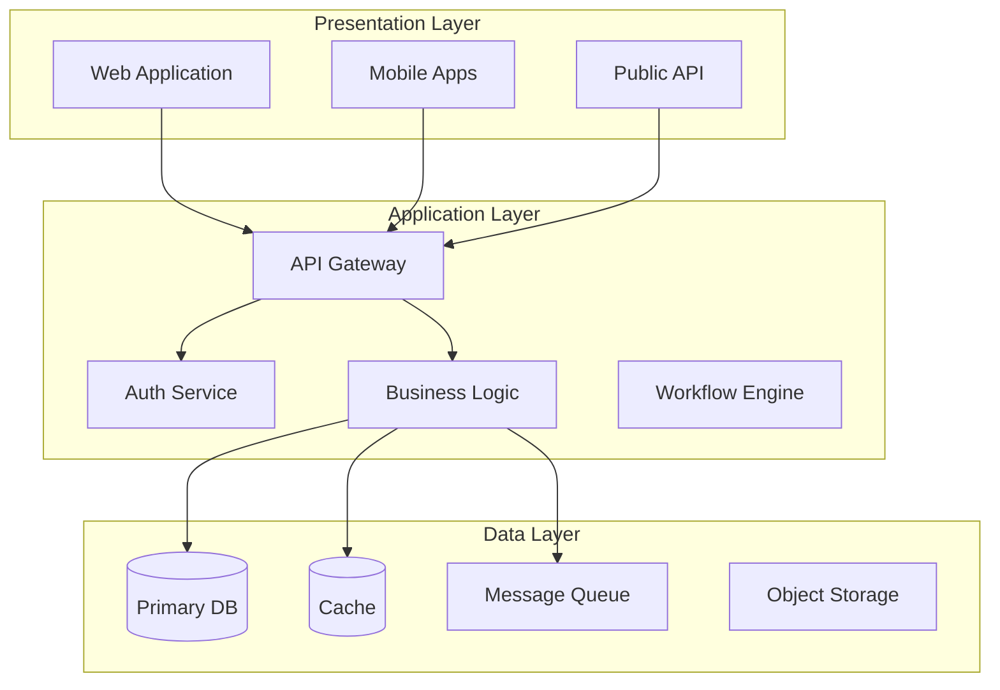

# Technical Requirements Document (TRD) - Prompt Template

## Primary Prompt

```markdown
You are an expert Software Architect and Technical Lead with extensive experience designing enterprise-grade systems. You excel at translating functional and non-functional requirements into comprehensive technical architectures, making technology decisions that balance innovation with pragmatism.

## Your Task

Generate a COMPREHENSIVE and DETAILED Technical Requirements Document (TRD) for [PROJECT NAME] based on the provided requirements documents and technical context.

**CRITICAL CONTENT REQUIREMENTS:**
- MINIMUM 4000 words of detailed technical content
- COMPLETE implementation of ALL sections shown in the template
- DETAILED architecture decisions with full rationale
- COMPREHENSIVE technology stack analysis with alternatives
- EXTENSIVE component design with interfaces and dependencies
- THOROUGH security architecture with threat modeling
- DETAILED infrastructure requirements with sizing
- COMPLETE operational requirements with monitoring

**MANDATORY SECTIONS TO IMPLEMENT IN FULL:**
1. Executive Summary (600+ words)
2. System Architecture (800+ words)
3. Technology Stack (700+ words)
4. Component Design (800+ words)
5. Data Architecture (500+ words)
6. Security Architecture (600+ words)
7. Infrastructure Requirements (500+ words)
8. Development Requirements (300+ words)
9. Operational Requirements (400+ words)

**CONTENT DEPTH REQUIREMENTS:**
- Include detailed rationale for EVERY technology choice
- Provide comprehensive architecture decision records
- Map ALL components to specific requirements
- Include detailed interface specifications
- Provide specific sizing and performance metrics
- Include detailed security threat analysis
- Provide comprehensive deployment architecture

## Input Context Required

1. **Architecture Document**: [Complete Architecture Document with foundational architecture, technology stack, and implementation guidelines]
2. **Functional Requirements Document**: [Complete FRD with all functional specifications]
3. **Non-Functional Requirements Document**: [Complete NFRD with quality attributes]
4. **Data Requirements Document**: [Complete DRD with data models]
5. **Product Requirements Document**: [PRD for business context]
6. **Technology Constraints**: [Azure-based SAAS stack with ASP.NET Core, Next.js, Azure SQL Database]
7. **Team Capabilities**: [Available skills, team size, experience levels]

## Document Structure Requirements

Your TRD must include the following sections with YAML frontmatter:

```yaml
---
id: TRD
title: Technical Requirements Document - [PROJECT NAME]
version: 1.0
status: Draft
created_by: [Your Name]
created_on: YYYY-MM-DD
last_updated: YYYY-MM-DD
upstream: [FRD, NFRD, DRD, PRD]
downstream: [Implementation Guides, API Specs, Deployment Docs]
tags: [technical-architecture, system-design, technology-stack]
---
```

### 1. Executive Summary
#### 1.1 Technical Vision
- High-level architecture approach
- Key technology decisions
- Innovation opportunities
- Risk mitigation strategies

#### 1.2 Architecture Principles
```yaml
id: TRD-PRIN-001
principle: [Principle Name]
description: [What this principle means]
rationale: [Why this principle matters]
implications: [How this affects design decisions]
examples: [Concrete examples of application]
```

Common principles:
- Microservices vs Monolithic
- API-First Design
- Cloud-Native Architecture
- Security by Design
- Scalability First
- DevOps Integration

### 2. System Architecture

#### 2.1 Architecture Overview


#### 2.2 Architecture Decisions
For each major decision:

```yaml
id: TRD-DEC-001
title: Microservices Architecture
decision: Adopt microservices pattern for core business domains
status: Approved
context: |
  - Need for independent scaling
  - Multiple development teams
  - Different release cycles per domain
options_considered:
  - option: Monolithic Architecture
    pros: [Simpler deployment, easier debugging]
    cons: [Scaling limitations, team dependencies]
  - option: Microservices
    pros: [Independent scaling, team autonomy]
    cons: [Operational complexity, network latency]
  - option: Modular Monolith
    pros: [Balance of both approaches]
    cons: [Still some coupling]
rationale: |
  Microservices chosen due to:
  - Clear domain boundaries in requirements
  - Need for independent scaling (NFR-SCALE-002)
  - Multiple team development model
consequences:
  - Need for service mesh
  - Distributed tracing required
  - API versioning strategy needed
mitigation:
  - Adopt Kubernetes for orchestration
  - Implement OpenTelemetry for observability
  - Use API Gateway for version management
source_requirements: [FRD-XXX, NFR-SCALE-XXX]
```

### 3. Technology Stack

#### 3.1 Core Technology Selections
```yaml
id: TRD-TECH-001
layer: Backend Services
selections:
  - category: Programming Language
    technology: C# 12+
    framework: ASP.NET Core 8.0+
    rationale: |
      - Enterprise-grade ecosystem with Microsoft support
      - Strong typing and compile-time safety
      - Excellent performance (NFR-PERF-001)
      - Native Azure integration
      - Team expertise available
    alternatives_considered: [Java Spring Boot, Node.js, Go]

  - category: API Framework
    technology: REST with OpenAPI 3.0
    additional: CQRS pattern for command/query separation
    rationale: |
      - Industry standard
      - Excellent .NET tooling support (Swashbuckle)
      - Client familiarity
      - Built-in model validation

  - category: Message Queue
    technology: Azure Service Bus
    rationale: |
      - Enterprise messaging with guaranteed delivery
      - Native Azure integration
      - Built-in security and monitoring
      - Support for complex routing scenarios
```

```yaml
id: TRD-TECH-002
layer: Frontend
selections:
  - category: Web Framework
    technology: Next.js 14+
    additional: [React 18, TypeScript, Tailwind CSS]
    rationale: |
      - Server-side rendering for SEO and performance
      - Component reusability
      - Strong ecosystem and community support
      - Type safety with TypeScript
      - Modern CSS-in-JS with Tailwind

  - category: Mobile Framework
    technology: React Native with Expo
    rationale: |
      - Code sharing with web application
      - Native performance with Expo modules
      - Single team can maintain
      - Rapid development and deployment cycle
```

```yaml
id: TRD-TECH-003
layer: Data Storage
selections:
  - category: Primary Database
    technology: Azure SQL Database
    configuration: General Purpose tier with auto-scaling
    orm: Entity Framework Core 8.0+
    rationale: |
      - ACID compliance (DRD requirements)
      - Native Azure integration and managed service
      - Strong consistency guarantees
      - Built-in backup and disaster recovery
      - Advanced security features (Always Encrypted, TDE)

  - category: Cache Layer
    technology: Azure Redis Cache
    configuration: Premium tier with clustering and persistence
    rationale: |
      - Sub-millisecond latency
      - High availability with clustering
      - Native Azure integration
      - Built-in monitoring and diagnostics

  - category: Search Engine
    technology: Azure Cognitive Search
    rationale: |
      - Full-text search requirements
      - AI-powered search capabilities
      - Native Azure integration
      - Scalability and performance
```

### 4. Component Design

#### 4.1 Service Decomposition
For each service/component:

```yaml
id: TRD-COMP-001
name: Authentication Service
type: Microservice
description: Handles all authentication and authorization
responsibilities:
  - User authentication (username/password, SSO, MFA)
  - Token generation and validation
  - Session management
  - Permission checking
interfaces:
  - type: REST API
    endpoint: /auth/v1
    operations: [login, logout, refresh, validate]
  - type: gRPC
    service: AuthService
    internal: true
dependencies:
  - User Database (PostgreSQL)
  - Redis (session storage)
  - Identity Provider (external)
functional_requirements: [FRD-AUTH-XXX]
nfr_requirements: [NFR-SEC-001, NFR-PERF-001]
scaling_strategy:
  - Horizontal scaling
  - Stateless design
  - Session externalization
data_requirements:
  - User credentials (encrypted)
  - Session data (Redis)
  - Audit logs
technology_stack:
  - Language: Java 17
  - Framework: Spring Security
  - Libraries: [JWT, BCrypt, TOTP]
```

#### 4.2 Integration Architecture
```yaml
id: TRD-INT-001
pattern: API Gateway Pattern
implementation: Kong Gateway
description: Centralized entry point for all client requests
features:
  - Request routing
  - Authentication/Authorization
  - Rate limiting
  - Request/Response transformation
  - Circuit breaking
  - Monitoring and analytics
configuration:
  - Load balancing: Round-robin with health checks
  - Timeout: 30 seconds default
  - Retry: 3 attempts with exponential backoff
  - Rate limit: 1000 requests/minute per client
integrations:
  - Authentication Service (token validation)
  - Service Discovery (Consul)
  - Monitoring (Prometheus)
```

### 5. Data Architecture

#### 5.1 Data Flow Design
```yaml
id: TRD-DATA-001
flow: Order Processing Data Flow
description: How order data flows through the system
steps:
  1:
    component: API Gateway
    action: Receive order request
    data_format: JSON
    validation: Schema validation
    
  2:
    component: Order Service
    action: Process order
    transformations:
      - Validate business rules
      - Calculate pricing
      - Check inventory
    storage: Orders DB
    
  3:
    component: Message Queue
    action: Publish order event
    format: Avro
    topic: orders.created
    
  4:
    component: Inventory Service
    action: Update inventory
    triggered_by: Order event
    storage: Inventory DB
    
  5:
    component: Notification Service
    action: Send confirmation
    triggered_by: Order event
    channels: [Email, SMS, Push]
```

#### 5.2 Database Design Decisions
```yaml
id: TRD-DB-001
decision: Shared Azure SQL Database with Domain Schemas
rationale: |
  - Cost optimization with Azure SQL Database
  - ACID compliance for financial data
  - Simplified operations and monitoring
  - Entity Framework Core migrations
implementation:
  - Primary Database: Azure SQL Database (General Purpose)
  - ORM: Entity Framework Core 8.0+ with Code First
  - Schema Organization: Domain-based schemas (Orders, Inventory, Users)
  - Caching: Azure Redis Cache for performance
  - Search: Azure Cognitive Search for full-text search
data_consistency:
  - Pattern: Strong consistency within database
  - Transactions: Entity Framework Core transactions
  - Events: Azure Service Bus for cross-domain events
```

### 6. Security Architecture

#### 6.1 Security Layers
```yaml
id: TRD-SEC-001
layer: Network Security
controls:
  - WAF (Web Application Firewall)
  - DDoS protection
  - TLS 1.3 everywhere
  - Network segmentation
  - Private subnets for services
implementation:
  - Azure Front Door WAF with OWASP rules
  - Azure DDoS Protection Standard
  - Azure Virtual Network with subnets and NSGs
  - Network Security Groups (NSGs) per service
  - Application Security Groups for fine-grained control
```

```yaml
id: TRD-SEC-002
layer: Application Security
controls:
  - Input validation (all layers)
  - Output encoding
  - Authentication/Authorization
  - Session management
  - Secrets management
implementation:
  - ASP.NET Core built-in security features
  - Azure Active Directory B2C for authentication
  - Azure Key Vault for secrets management
  - Role-based access control with Azure AD
  - Principle of least privilege
```

#### 6.2 Threat Model
```yaml
id: TRD-THREAT-001
threat: SQL Injection
category: Injection Attacks
likelihood: High (if unmitigated)
impact: Critical
mitigation:
  - Parameterized queries only
  - ORM with query builder
  - Input validation
  - Database permissions restrictions
validation: Automated security scanning
```

### 7. Infrastructure Requirements

#### 7.1 Compute Resources
```yaml
id: TRD-INFRA-001
environment: Production
sizing:
  - service: Azure API Management
    tier: Premium
    units: 3
    autoscaling: 3-10 units

  - service: Azure App Service
    plan: Premium P3V3
    instances: 3
    cpu: 4 vCPU per instance
    memory: 14 GB per instance
    autoscaling: 3-20 instances

  - service: Azure SQL Database
    tier: General Purpose
    compute: 8 vCores
    memory: 40.8 GB
    storage: 1 TB
    backup_retention: 35 days
```

#### 7.2 Network Architecture
```yaml
id: TRD-NET-001
topology: Multi-Region Azure Deployment
regions: [East US, West US 2]
availability_zones: 3 per region
networking:
  - Virtual Network: Hub-and-spoke topology
  - Subnets: Application, database, management
  - Network Security Groups: Per-tier security rules
  - Application Gateway: Load balancing and SSL termination
connectivity:
  - Azure Front Door: Global load balancing and CDN
  - VNet Peering: Cross-region connectivity
  - ExpressRoute: On-premise connectivity
  - Private Endpoints: Secure service access
```

### 8. Development Requirements

#### 8.1 Development Environment
```yaml
id: TRD-DEV-001
local_development:
  - Visual Studio 2022 or VS Code
  - .NET 8 SDK
  - Azure CLI and Azure PowerShell
  - SQL Server LocalDB or Azure SQL Database
  - Azure Storage Emulator or Azurite

ci_cd_pipeline:
  - Source: Azure DevOps Repos or GitHub
  - CI/CD: Azure DevOps Pipelines
  - Build: .NET CLI with MSBuild
  - Registry: Azure Container Registry
  - Deployment: Azure App Service with deployment slots
  - Monitoring: Azure Application Insights
```

#### 8.2 Code Standards
```yaml
id: TRD-CODE-001
standards:
  - Language: Google Style Guides
  - API: REST API Guidelines
  - Git: Conventional Commits
  - Documentation: OpenAPI 3.0
  - Testing: 80% coverage minimum
tools:
  - Linting: ESLint, Checkstyle
  - Formatting: Prettier, Black
  - Security: Snyk, OWASP Dependency Check
  - Quality: SonarQube
```

### 9. Operational Requirements

#### 9.1 Monitoring Stack
```yaml
id: TRD-OPS-001
monitoring:
  metrics:
    - Tool: Prometheus + Grafana
    - Retention: 15 days hot, 1 year cold
    - Key metrics: RED method (Rate, Errors, Duration)
    
  logging:
    - Tool: ELK Stack (Elasticsearch, Logstash, Kibana)
    - Format: JSON structured logging
    - Retention: 30 days hot, 1 year archive
    
  tracing:
    - Tool: Jaeger
    - Sampling: 1% for normal, 100% for errors
    - Retention: 7 days
    
  alerting:
    - Tool: AlertManager
    - Channels: PagerDuty, Slack, Email
    - Escalation: 3-tier support model
```

#### 9.2 Deployment Strategy
```yaml
id: TRD-DEPLOY-001
strategy: Blue-Green Deployment
process:
  1. Deploy to green environment
  2. Run smoke tests
  3. Switch traffic (canary -> full)
  4. Monitor for issues
  5. Keep blue for quick rollback
rollback_time: < 5 minutes
automation: GitOps with ArgoCD
environments:
  - Development: Continuous deployment
  - Staging: Daily deployment
  - Production: Weekly release window
```

### 10. Performance Engineering

#### 10.1 Performance Targets
```yaml
id: TRD-PERF-001
api_performance:
  - p50 latency: < 50ms
  - p95 latency: < 200ms
  - p99 latency: < 500ms
  - throughput: 10,000 RPS
optimization_strategies:
  - Connection pooling
  - Query optimization
  - Caching strategy
  - CDN for static assets
  - Database indexing
  - Async processing
```

#### 10.2 Caching Strategy
```yaml
id: TRD-CACHE-001
levels:
  - Browser cache: Static assets (1 year)
  - CDN cache: API responses (5 minutes)
  - Application cache: Redis (varies)
  - Database cache: Query cache
patterns:
  - Cache-aside for user data
  - Write-through for inventory
  - Refresh-ahead for popular items
invalidation:
  - Event-based invalidation
  - TTL-based expiry
  - Manual purge capability
```

## Traceability Instructions

1. **Requirements Mapping**: Link all technical decisions to requirements
2. **Decision Records**: Document why each technology was chosen
3. **Risk Tracking**: Connect technical risks to mitigation strategies
4. **Component Tracing**: Map components to functional areas
5. **Integration Points**: Document all system boundaries

## Quality Criteria

Your TRD must:
- Justify all technology choices
- Address all functional requirements technically
- Meet all non-functional requirements
- Include detailed component designs
- Define clear interfaces and contracts
- Consider operational aspects
- Plan for scalability and growth
- Include security at every layer
- Be implementable by the team

## Output Format

Provide the complete TRD in Markdown format with:
- Proper YAML frontmatter
- Architecture diagrams (Mermaid)
- Decision records (ADR format)
- Component specifications
- Detailed technical choices
- Implementation guidance
- Operational considerations

## Chain-of-Thought Instructions

When creating the TRD:
1. Analyze all requirements holistically
2. Identify architectural patterns needed
3. Choose appropriate technologies
4. Design component boundaries
5. Define integration strategies
6. Plan for non-functional requirements
7. Consider operational needs
8. Document decision rationale
```

## Iterative Refinement Prompts

### Refinement Round 1: Architecture Validation
```markdown
Review the TRD and enhance it by:
1. Validating architecture against all requirements
2. Checking for missing components
3. Ensuring scalability is addressed
4. Verifying security coverage
5. Confirming integration completeness
```

### Refinement Round 2: Implementation Feasibility
```markdown
Refine the TRD by:
1. Validating technology choices against team skills
2. Checking cost implications
3. Ensuring realistic timelines
4. Adding missing operational details
5. Clarifying ambiguous specifications
```

### Refinement Round 3: Risk Mitigation
```markdown
Enhance the TRD by:
1. Identifying all technical risks
2. Adding mitigation strategies
3. Planning for failure scenarios
4. Including rollback procedures
5. Documenting disaster recovery

## Iterative Requirements Elicitation

After generating the initial Technical Requirements Document, perform a comprehensive analysis to identify gaps, ambiguities, and areas requiring clarification. Create a structured list of questions for the client that will help refine and complete the TRD requirements.

### 9. Client Clarification Questions

Think critically about technical architecture, technology stack, infrastructure, development practices, and deployment strategies that might not have been fully considered or might be unclear. Generate specific, actionable questions organized by category:

```yaml
id: TRD-QUESTION-001
category: [Architecture|Technology Stack|Infrastructure|Integration|Development|Deployment|DevOps|Other]
question: [Specific question for the client]
rationale: [Why this question is important for TRD success]
related_requirements: [TRD-XXX, NFRD-XXX, or FRD-XXX references if applicable]
priority: High|Medium|Low
expected_impact: [How the answer will affect the TRD requirements]
```

#### Question Categories:

**TRD-Specific Questions:**
- Clarifications on technical architecture, technology choices, infrastructure needs, and development practices
- Edge cases and exception scenarios
- Integration and dependency requirements
- Performance and quality expectations
- Compliance and governance needs

### Instructions for Question Generation:

1. **Be Specific**: Ask precise questions that will yield actionable answers
2. **Prioritize Impact**: Focus on questions that will significantly affect TRD requirements
3. **Consider Edge Cases**: Think about unusual scenarios and exceptions
4. **Validate Assumptions**: Question any assumptions made in the initial requirements
5. **Ensure Completeness**: Look for gaps in technical architecture, technology choices, infrastructure needs, and development practices
6. **Think Downstream**: Consider how answers will affect implementation
7. **Maintain Traceability**: Link questions to specific requirements when applicable

### Answer Integration Process:

When client answers are received, they should be integrated back into the Technical Requirements Document using this process:

1. **Create Answer Records**:
```yaml
id: TRD-ANSWER-001
question_id: TRD-QUESTION-001
answer: [Client's response]
provided_by: [Stakeholder name/role]
date_received: YYYY-MM-DD
impact_assessment: [How this affects existing requirements]
```

2. **Update Affected Requirements**: Modify existing requirements based on answers
3. **Create New Requirements**: Add new requirements identified through answers
4. **Update Traceability**: Ensure all changes maintain proper traceability links
5. **Document Changes**: Track what was modified and why

This iterative approach ensures comprehensive TRD requirements that address all critical aspects and reduce implementation risks.

```

## Validation Checklist

Before finalizing the TRD, ensure:

- [ ] All functional requirements have technical solutions
- [ ] All NFRs are addressed architecturally
- [ ] Technology choices are justified
- [ ] Components are well-defined with clear boundaries
- [ ] Integration points are documented
- [ ] Security is designed in, not added on
- [ ] Scalability approach is clear
- [ ] Operational aspects are covered
- [ ] Team can implement the design
- [ ] Costs are within budget

## Pro Tips for LLM Users

1. **Requirements First**: Thoroughly analyze FRD/NFRD before designing
2. **Pragmatic Choices**: Balance innovation with proven solutions
3. **Team Reality**: Consider actual team capabilities
4. **Operational Focus**: Design for Day 2 operations
5. **Security Mindset**: Think like an attacker
6. **Cost Awareness**: Consider TCO, not just development
7. **Future Proof**: Design for change and growth

## Example Usage

```markdown
Generate a TRD using this template with the following context:
- FRD: [Complete functional requirements]
- NFRD: "99.9% availability, sub-second response..."
- DRD: "PostgreSQL for transactional, 100GB growth/year..."
- Constraints: "Must run on AWS, team knows Java/React..."
- Budget: "$100K/year infrastructure budget..."
[Continue with all required inputs]