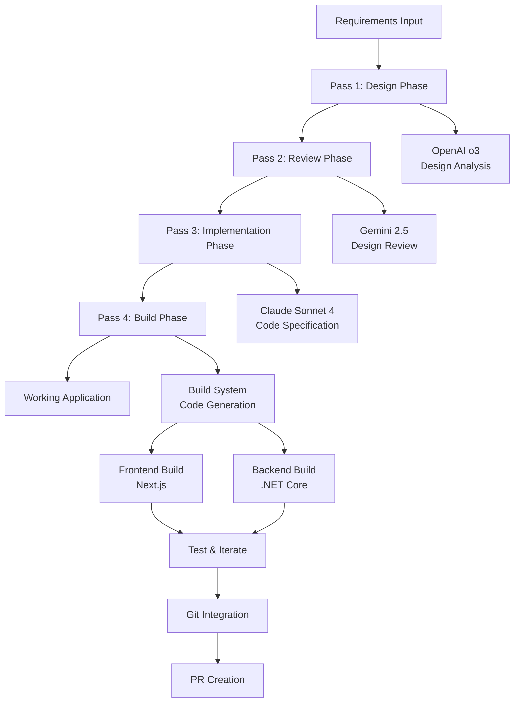

# AI-Driven Application Builder Architecture

## Overview

The Application Builder system implements a 4-pass AI workflow that transforms requirements into working applications. Each pass uses a different AI model optimized for its specific role in the development process.

## Architecture Diagram



## 4-Pass System Design

### Pass 1: Design Phase (OpenAI o3)
**Purpose**: Analyze requirements and create high-level system design

**Input**:
- Existing requirements documents from `/Requirements` directory
- Feature specifications
- System constraints and preferences

**Process**:
- Analyze business requirements and technical constraints
- Design system architecture and component structure
- Define data models and API interfaces
- Create component interaction diagrams
- Identify technology stack decisions

**Output**:
- System Architecture Document
- Component Design Specifications
- Data Model Definitions
- API Interface Designs
- Technology Stack Recommendations

**Logging**: `logs/pass1_design.log`

### Pass 2: Review Phase (Gemini 2.5)
**Purpose**: Review and validate the design from Pass 1

**Input**:
- Design documents from Pass 1
- Original requirements for validation
- System architecture patterns and best practices

**Process**:
- Validate design completeness and consistency
- Check alignment with requirements
- Identify potential issues and improvements
- Suggest optimizations and alternatives
- Ensure scalability and maintainability

**Output**:
- Design Review Report
- Validated System Architecture
- Improvement Recommendations
- Risk Assessment
- Final Design Approval

**Logging**: `logs/pass2_review.log`

### Pass 3: Implementation Phase (Claude Sonnet 4)
**Purpose**: Create detailed implementation specifications

**Input**:
- Validated design from Pass 2
- Existing codebase structure (FrontEnd/BackEnd templates)
- Development patterns and conventions

**Process**:
- Create detailed code specifications
- Define file structure and organization
- Generate implementation roadmap
- Create detailed API specifications
- Define database schema and migrations

**Output**:
- Detailed Implementation Plan (Markdown)
- File Structure Specifications
- Code Generation Instructions
- Database Migration Scripts
- API Implementation Details

**Logging**: `logs/pass3_implementation.log`

### Pass 4: Build Phase (Automated System)
**Purpose**: Generate actual code and build working application

**Input**:
- Implementation specifications from Pass 3
- Template structures (FrontEnd/BackEnd)
- Build configurations and dependencies

**Process**:
- Generate actual code files
- Create Git feature branch
- Implement iterative build/test loops
- Handle compilation errors with AI feedback
- Run tests and fix issues
- Create pull request

**Output**:
- Working application code
- Passing tests
- Git feature branch
- GitHub Pull Request

**Logging**: `logs/pass4_build.log`

## System Components

### ApplicationBuilder Class
```python
class ApplicationBuilder:
    def __init__(self, project_name: str, requirements_path: Path, config: Dict)
    async def run_full_workflow(self, feature_spec: str) -> BuildResult
    async def run_pass(self, pass_number: int, input_data: Any) -> PassResult
    def setup_logging(self, pass_number: int) -> Logger
    def create_feature_branch(self, feature_name: str) -> str
```

### Pass Implementations
- `DesignPass`: OpenAI o3 integration for system design
- `ReviewPass`: Gemini 2.5 integration for design validation
- `ImplementationPass`: Claude Sonnet 4 integration for code specification
- `BuildPass`: Automated build system with error handling

### Build System Components
- `GitManager`: Git operations and branch management
- `FrontendBuilder`: Next.js build system integration
- `BackendBuilder`: .NET Core build system integration
- `TestRunner`: Automated testing and validation

## Configuration Structure

```yaml
application_builder:
  enabled: true
  max_retries: 4
  timeout_minutes: 30
  
  passes:
    design:
      model: "openai"
      model_name: "o3-mini"
      temperature: 0.2
      max_tokens: 4000
    
    review:
      model: "gemini"
      model_name: "gemini-2.5-pro"
      temperature: 0.1
      max_tokens: 3000
    
    implementation:
      model: "anthropic"
      model_name: "claude-3-sonnet-20240229"
      temperature: 0.2
      max_tokens: 4000
  
  build_system:
    frontend:
      build_command: ["npm", "run", "build"]
      test_command: ["npm", "test"]
      dev_command: ["npm", "run", "dev"]
    
    backend:
      build_command: ["dotnet", "build"]
      test_command: ["dotnet", "test"]
      run_command: ["dotnet", "run"]
  
  git:
    auto_commit: true
    branch_prefix: "feature/ai-generated"
    create_pr: true
    pr_template: "templates/pr_template.md"

logging:
  separate_terminals: true
  log_level: "INFO"
  real_time_monitoring: true
```

## Integration Points

### With Existing Orchestrator
- Extends existing menu system (option 10)
- Uses existing API key management
- Leverages existing configuration system
- Integrates with monitoring dashboard

### With Template Structure
- Reads existing FrontEnd/BackEnd templates
- Preserves existing architecture patterns
- Maintains Clean Architecture principles
- Follows existing naming conventions

## Safety and Error Handling

### Retry Mechanisms
- Maximum 4 retries per pass
- Exponential backoff for API calls
- Graceful degradation on failures

### Resource Management
- Token budget tracking
- API rate limit handling
- Memory usage monitoring

### Branch Isolation
- All work done in feature branches
- No direct commits to main branch
- Automated cleanup on failures

### Validation Gates
- Each pass validates its output
- Dependency checking between passes
- Final integration validation

## Monitoring and Logging

### Real-time Progress Tracking
- Separate log files for each pass
- Integration with existing dashboard
- Progress indicators and ETAs

### Error Tracking
- Detailed error logging
- Recovery attempt tracking
- Performance metrics collection

This architecture provides a robust, scalable foundation for AI-driven application development while maintaining safety, observability, and integration with existing systems.
