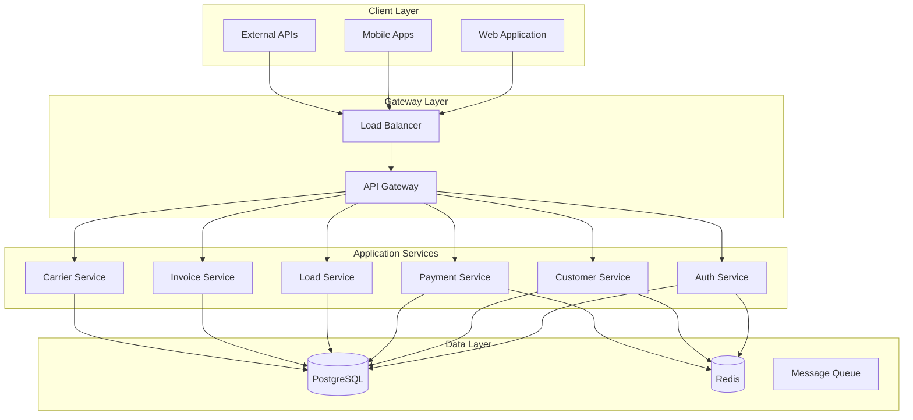

# FY.WB.Midway Enterprise Logistics Platform

## Project Overview

Welcome to the comprehensive documentation for the **FY.WB.Midway Enterprise Logistics Platform** - a cutting-edge, cloud-native solution designed to revolutionize logistics operations for mid-sized enterprises.

!!! info "Project Status"
    This documentation represents the complete requirements, technical specifications, and implementation guidelines for the FY.WB.Midway platform as of **June 2025**.

## Platform Capabilities

The FY.WB.Midway platform provides:

- **🚚 Load Management** - Advanced booking, tracking, and optimization
- **💳 Payment Processing** - Secure, PCI-compliant financial transactions
- **👥 Customer Management** - Comprehensive CRM with KYC capabilities
- **📄 Invoice Processing** - Automated generation and financial reporting
- **🚛 Carrier Management** - Self-service portal and performance tracking
- **📊 Real-time Analytics** - Performance insights and predictive analytics

## Architecture Highlights

## Documentation Structure

This documentation is organized into the following sections:

### 📋 Requirements Documentation
Comprehensive business, product, and functional requirements that define what the system must accomplish.

- [Business Requirements](requirements/brd.md) - Strategic objectives and business needs
- [Product Requirements](requirements/prd.md) - Product vision and user stories
- [Functional Requirements](requirements/frd.md) - Detailed feature specifications
- [Non-Functional Requirements](requirements/nfrd.md) - Performance, security, and quality requirements
- [Data Requirements](requirements/drd.md) - Data models and information architecture

### 🏗️ Technical Documentation
Detailed technical specifications covering architecture, technology choices, and implementation guidelines.

- [Technical Requirements](technical/trd.md) - Master technical document
- [System Architecture](technical/trd_architecture.md) - High-level system design
- [Technology Stack](technical/trd_technology_stack.md) - Technology selections and rationale
- [Security Architecture](technical/trd_security.md) - Security layers and threat model
- [Infrastructure](technical/trd_infrastructure.md) - Deployment and infrastructure requirements
- [Performance Engineering](technical/trd_performance.md) - Performance optimization strategies
- [Operations & DevOps](technical/trd_operations.md) - Operational procedures and automation

### 🔌 API Documentation
Complete API specifications with detailed endpoint documentation and integration guidelines.

- [API Overview](api/api_spec.md) - API architecture and design principles
- [Security & Authentication](api/api_spec_security.md) - API security implementation
- [Components & Schemas](api/api_spec_components.md) - Data models and schemas
- [Error Handling](api/api_spec_errors.md) - Error patterns and responses

### 🎨 UI/UX Documentation
User interface specifications and design guidelines for all platform interfaces.

- [UI/UX Overview](uiux/uiux_spec.md) - Design principles and guidelines
- [Information Architecture](uiux/uiux_spec_architecture.md) - Navigation and content structure
- [Component Library](uiux/uiux_spec_components.md) - Reusable UI components
- [Interaction Patterns](uiux/uiux_spec_interactions.md) - User interaction guidelines

### 🧪 Testing Documentation
Comprehensive testing strategy, test cases, and quality assurance procedures.

- [Test Plan Overview](testing/test_plan.md) - Testing strategy and approach
- [Test Strategy](testing/test_strategy.md) - Testing methodology and levels
- [Functional Test Cases](testing/test_cases_functional.md) - Feature validation tests
- [Performance Test Cases](testing/test_cases_performance.md) - Load and stress testing
- [Security Test Cases](testing/test_cases_security.md) - Security validation tests
- [Test Automation](testing/test_automation.md) - Automation framework and scripts

### 📊 Project Management
Project tracking, traceability, and management documentation.

- [Requirements Traceability Matrix](management/rtm.md) - Complete requirement tracking and validation

## Key Features

!!! success "Enterprise-Grade Capabilities"
    - **Microservices Architecture** with independent scaling
    - **Cloud-Native Design** optimized for Kubernetes
    - **API-First Approach** with comprehensive OpenAPI specifications
    - **Security by Design** with multi-layer protection
    - **Real-Time Processing** with event-driven architecture
    - **Comprehensive Monitoring** with observability built-in

## Technology Stack

| Layer | Technology | Purpose |
|-------|------------|---------|
| **Frontend** | React 18 + TypeScript | Modern, responsive web application |
| **Backend** | Java 17 + Spring Boot 3.x | Enterprise-grade microservices |
| **Database** | PostgreSQL 15 | ACID-compliant data storage |
| **Cache** | Redis Cluster | High-performance caching |
| **Message Queue** | Apache Kafka | Event streaming and communication |
| **Container Platform** | Docker + Kubernetes | Orchestrated deployment |
| **Cloud Provider** | Amazon Web Services | Scalable cloud infrastructure |

## Getting Started

To explore the documentation:

1. **Start with [Business Requirements](requirements/brd.md)** to understand the project vision
2. **Review [System Architecture](technical/trd_architecture.md)** for technical overview
3. **Explore [API Documentation](api/api_spec.md)** for integration details
4. **Check [Test Plans](testing/test_plan.md)** for quality assurance approach

## Project Timeline

- **Phase 1**: Requirements and Architecture (Completed)
- **Phase 2**: Core Development (In Progress)
- **Phase 3**: Integration and Testing (Planned)
- **Phase 4**: Deployment and Go-Live (Planned)

---

*This documentation is automatically generated from the FY.WB.Midway requirements generation system and is kept up-to-date with the latest project specifications.*
