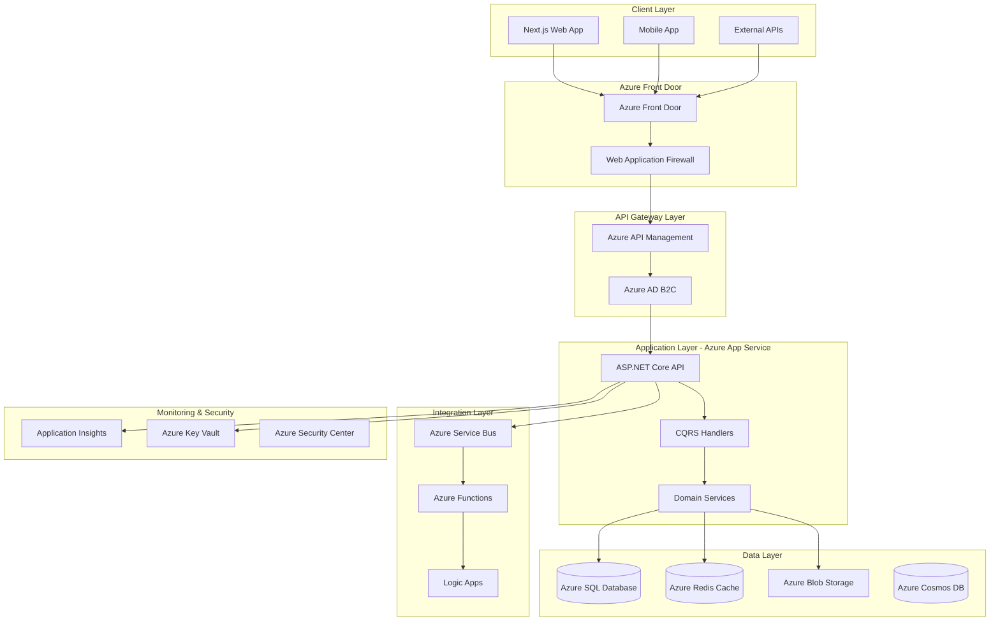
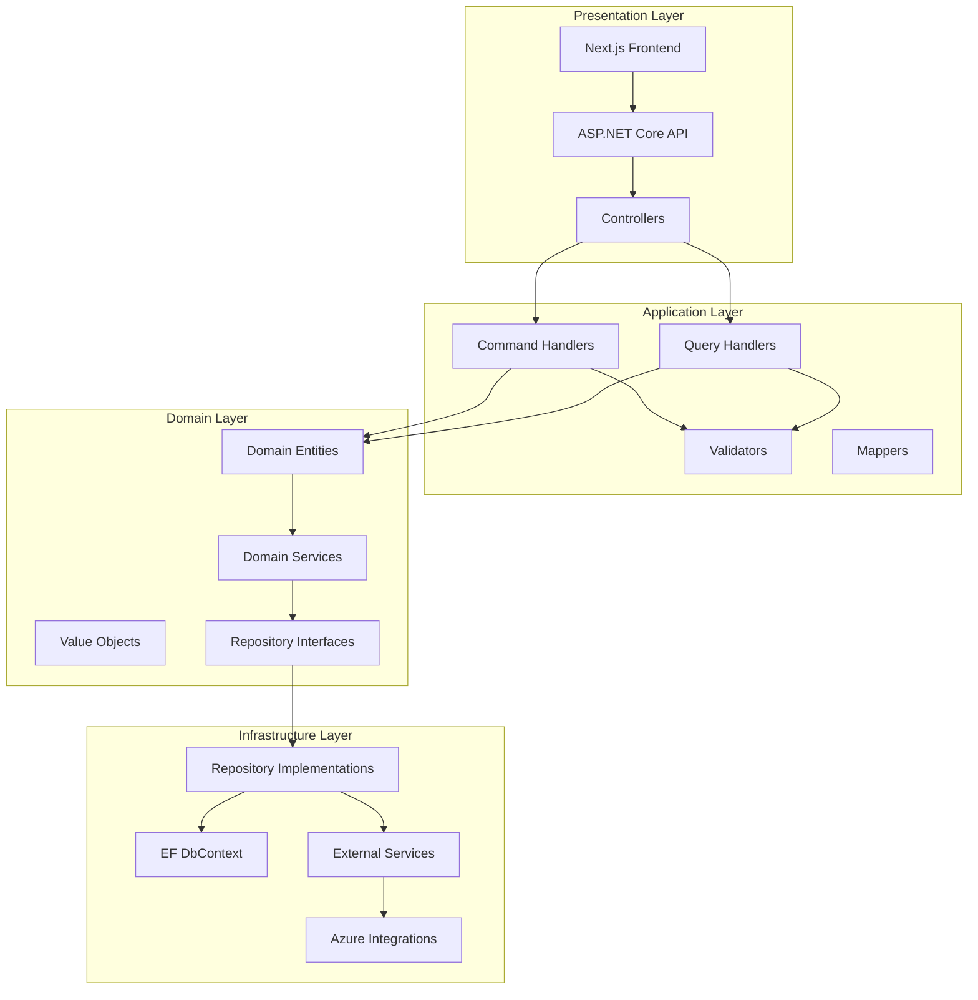
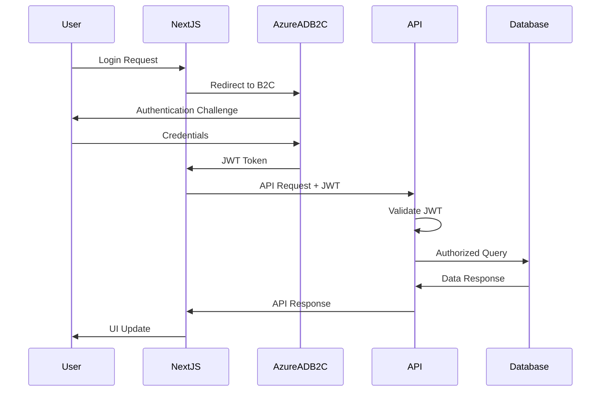

# System Architecture Document (SAD)
**Project LSOMigrator - Comprehensive Architecture Specification**  
Version 1.0 | Generated: 2025-06-16

---

## Table of Contents
1. [Executive Summary](#1-executive-summary)
2. [Foundational Architecture](#2-foundational-architecture)
3. [Technology Stack](#3-technology-stack)
4. [Layered Architecture](#4-layered-architecture)
5. [Domain Architecture](#5-domain-architecture)
6. [Cross-Cutting Concerns](#6-cross-cutting-concerns)
7. [Azure Integration](#7-azure-integration)
8. [Security Architecture](#8-security-architecture)
9. [Performance & Scalability](#9-performance--scalability)
10. [Implementation Guidelines](#10-implementation-guidelines)

---

## 1. Executive Summary

### 1.1 Architecture Vision
The LSOMigrator platform is designed as a modern, cloud-native SAAS solution built on Microsoft Azure, following Clean Architecture principles and CQRS patterns. The system provides a scalable, maintainable, and secure logistics management platform.

### 1.2 Key Architectural Decisions
- **Frontend**: Next.js with TypeScript and Tailwind CSS
- **Backend**: ASP.NET Core 8.0+ with Clean Architecture
- **Database**: Azure SQL Database with Entity Framework Core
- **Cloud Platform**: Microsoft Azure with comprehensive service integration
- **Architecture Pattern**: CQRS with Domain-Driven Design

---

## 2. Foundational Architecture

### 2.1 High-Level System Architecture



### 2.2 Architecture Principles
1. **Separation of Concerns**: Clear boundaries between layers and domains
2. **Dependency Inversion**: Dependencies point inward toward the domain
3. **Single Responsibility**: Each component has one reason to change
4. **Open/Closed Principle**: Open for extension, closed for modification
5. **Interface Segregation**: Clients depend only on interfaces they use
6. **DRY (Don't Repeat Yourself)**: Eliminate code duplication
7. **SOLID Principles**: Foundation for maintainable code

---

## 3. Technology Stack

### 3.1 Frontend Technology Stack
```yaml
Framework: Next.js 14+
Language: TypeScript 5+
Styling: Tailwind CSS 3+
State Management: Zustand or Redux Toolkit
UI Components: Headless UI / Radix UI
Forms: React Hook Form
Validation: Zod
HTTP Client: Axios
Testing: Jest + React Testing Library
Build Tool: Turbopack
Package Manager: pnpm
```

### 3.2 Backend Technology Stack
```yaml
Framework: ASP.NET Core 8.0+
Language: C# 12+
ORM: Entity Framework Core 8+
Database: Azure SQL Database
Cache: Azure Redis Cache
Message Queue: Azure Service Bus
File Storage: Azure Blob Storage
Authentication: Azure AD B2C
API Documentation: Swagger/OpenAPI
Testing: xUnit + FluentAssertions
Logging: Serilog + Azure Application Insights
```

### 3.3 Azure Services Integration
```yaml
Compute: Azure App Service
Database: Azure SQL Database
Cache: Azure Redis Cache
Storage: Azure Blob Storage
CDN: Azure Front Door
API Gateway: Azure API Management
Authentication: Azure AD B2C
Monitoring: Azure Application Insights
Security: Azure Key Vault
Messaging: Azure Service Bus
Functions: Azure Functions
DevOps: Azure DevOps / GitHub Actions
```

---

## 4. Layered Architecture

### 4.1 Clean Architecture Layers



### 4.2 Layer Responsibilities

**Presentation Layer:**
- Next.js frontend application
- ASP.NET Core Web API controllers
- Request/Response DTOs
- Authentication and authorization

**Application Layer:**
- CQRS command and query handlers
- Application services and use cases
- Input validation and business rule orchestration
- Cross-cutting concern coordination

**Domain Layer:**
- Business entities and value objects
- Domain services and business logic
- Repository and service interfaces
- Domain events and specifications

**Infrastructure Layer:**
- Data access implementations
- External service integrations
- Azure service implementations
- Cross-cutting concern implementations

---

## 5. Domain Architecture

### 5.1 Domain Model Structure

```mermaid
classDiagram
    class Customer {
        +CustomerId Id
        +string CompanyName
        +ContactInfo PrimaryContact
        +Address BillingAddress
        +PaymentTerms Terms
        +CreateLoad()
        +UpdateProfile()
    }
    
    class Load {
        +LoadId Id
        +CustomerId CustomerId
        +LoadStatus Status
        +PickupLocation Origin
        +DeliveryLocation Destination
        +DateTime PickupDate
        +DateTime DeliveryDate
        +decimal Rate
        +AssignCarrier()
        +UpdateStatus()
    }
    
    class Carrier {
        +CarrierId Id
        +string CompanyName
        +DOTNumber DOT
        +MCNumber MC
        +InsuranceInfo Insurance
        +AcceptLoad()
        +UpdateLocation()
    }
    
    class Invoice {
        +InvoiceId Id
        +LoadId LoadId
        +decimal Amount
        +InvoiceStatus Status
        +DateTime DueDate
        +GenerateInvoice()
        +ProcessPayment()
    }
    
    class Payment {
        +PaymentId Id
        +InvoiceId InvoiceId
        +decimal Amount
        +PaymentMethod Method
        +DateTime ProcessedDate
        +ProcessPayment()
        +RefundPayment()
    }
    
    Customer ||--o{ Load : creates
    Load ||--|| Carrier : assigned_to
    Load ||--|| Invoice : generates
    Invoice ||--o{ Payment : receives
```

### 5.2 Aggregate Boundaries
- **Customer Aggregate**: Customer, ContactInfo, Address
- **Load Aggregate**: Load, LoadDetails, LoadStatus
- **Carrier Aggregate**: Carrier, Equipment, Insurance
- **Invoice Aggregate**: Invoice, InvoiceLineItems, PaymentTerms
- **Payment Aggregate**: Payment, PaymentMethod, Transaction

---

## 6. Cross-Cutting Concerns

### 6.1 Logging Architecture
```csharp
// Structured logging with Serilog
public class LoggingService : ILoggingService
{
    private readonly ILogger<LoggingService> _logger;
    
    public void LogInformation(string message, params object[] args)
    {
        _logger.LogInformation(message, args);
    }
    
    public void LogError(Exception ex, string message, params object[] args)
    {
        _logger.LogError(ex, message, args);
    }
}

// Application Insights integration
services.AddApplicationInsightsTelemetry();
services.AddSingleton<ILoggingService, LoggingService>();
```

### 6.2 Caching Strategy
```csharp
// Redis caching implementation
public class CacheService : ICacheService
{
    private readonly IDistributedCache _cache;
    
    public async Task<T> GetAsync<T>(string key)
    {
        var value = await _cache.GetStringAsync(key);
        return value == null ? default(T) : JsonSerializer.Deserialize<T>(value);
    }
    
    public async Task SetAsync<T>(string key, T value, TimeSpan expiration)
    {
        var serializedValue = JsonSerializer.Serialize(value);
        await _cache.SetStringAsync(key, serializedValue, new DistributedCacheEntryOptions
        {
            AbsoluteExpirationRelativeToNow = expiration
        });
    }
}
```

### 6.3 Validation Framework
```csharp
// FluentValidation implementation
public class CreateLoadCommandValidator : AbstractValidator<CreateLoadCommand>
{
    public CreateLoadCommandValidator()
    {
        RuleFor(x => x.CustomerId)
            .NotEmpty()
            .WithMessage("Customer ID is required");
            
        RuleFor(x => x.PickupDate)
            .GreaterThan(DateTime.Now)
            .WithMessage("Pickup date must be in the future");
            
        RuleFor(x => x.Rate)
            .GreaterThan(0)
            .WithMessage("Rate must be greater than zero");
    }
}
```

---

## 7. Azure Integration

### 7.1 Azure Service Configuration
```yaml
# Azure App Service Configuration
App Service Plan: Premium P1V3
Runtime Stack: .NET 8
Operating System: Windows
Deployment: Azure DevOps Pipeline

# Azure SQL Database Configuration
Service Tier: General Purpose
Compute Tier: Provisioned
Hardware Generation: Gen5
vCores: 4
Storage: 250 GB
Backup Retention: 35 days

# Azure Redis Cache Configuration
Pricing Tier: Premium P1
Memory: 6 GB
Clustering: Enabled
Persistence: RDB backup enabled
```

### 7.2 Azure Key Vault Integration
```csharp
// Key Vault configuration
public class KeyVaultService : IKeyVaultService
{
    private readonly SecretClient _secretClient;
    
    public KeyVaultService(SecretClient secretClient)
    {
        _secretClient = secretClient;
    }
    
    public async Task<string> GetSecretAsync(string secretName)
    {
        var secret = await _secretClient.GetSecretAsync(secretName);
        return secret.Value.Value;
    }
}

// Startup configuration
builder.Configuration.AddAzureKeyVault(
    new Uri($"https://{keyVaultName}.vault.azure.net/"),
    new DefaultAzureCredential());
```

---

## 8. Security Architecture

### 8.1 Authentication & Authorization Flow


### 8.2 Security Implementation
```csharp
// JWT Authentication configuration
services.AddAuthentication(JwtBearerDefaults.AuthenticationScheme)
    .AddJwtBearer(options =>
    {
        options.Authority = $"https://{tenantName}.b2clogin.com/{tenantId}/{policyName}/v2.0/";
        options.Audience = clientId;
        options.TokenValidationParameters = new TokenValidationParameters
        {
            ValidateIssuer = true,
            ValidateAudience = true,
            ValidateLifetime = true,
            ValidateIssuerSigningKey = true
        };
    });

// Authorization policies
services.AddAuthorization(options =>
{
    options.AddPolicy("AdminOnly", policy => policy.RequireRole("Admin"));
    options.AddPolicy("CustomerAccess", policy => policy.RequireRole("Customer", "Admin"));
    options.AddPolicy("CarrierAccess", policy => policy.RequireRole("Carrier", "Admin"));
});
```

---

## 9. Performance & Scalability

### 9.1 Performance Optimization Strategies
- **Database Optimization**: Proper indexing, query optimization, connection pooling
- **Caching**: Redis for frequently accessed data, output caching for API responses
- **CDN**: Azure Front Door for static content delivery
- **Async Processing**: Background jobs for heavy operations
- **Pagination**: Implement proper pagination for large datasets

### 9.2 Scalability Patterns
- **Horizontal Scaling**: Azure App Service auto-scaling
- **Database Scaling**: Read replicas for query distribution
- **Microservices**: Domain-based service decomposition
- **Event-Driven Architecture**: Asynchronous communication patterns

---

## 10. Implementation Guidelines

### 10.1 Development Standards
- Follow Clean Code principles and SOLID design patterns
- Implement comprehensive unit and integration testing (85%+ coverage)
- Use dependency injection for loose coupling
- Implement proper error handling and logging
- Follow consistent naming conventions and code formatting

### 10.2 Deployment Strategy
- Use Infrastructure as Code (Bicep/ARM templates)
- Implement CI/CD pipelines with automated testing
- Use feature flags for gradual rollouts
- Implement blue-green deployment for zero-downtime updates
- Monitor application performance and health continuously

---

*This architecture document serves as the foundation for the LSOMigrator platform development and should be referenced throughout the implementation process.*
