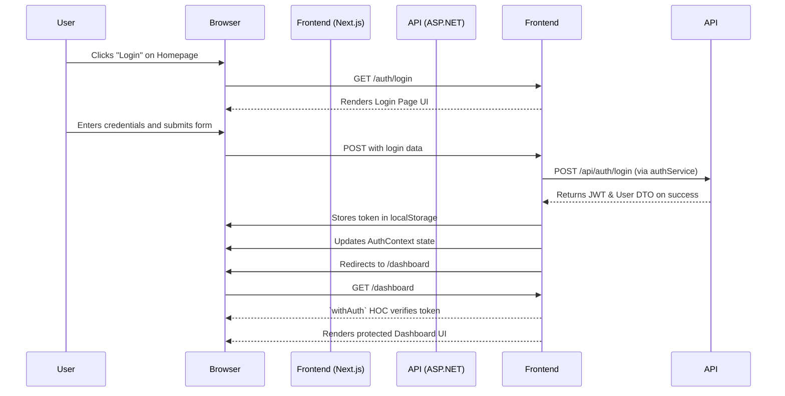

# Project Plan: Frontend Authentication System Implementation

**Objective:** To implement a complete, secure, and user-friendly authentication system for the frontend application. This includes creating dedicated pages for login, registration, and password recovery, protecting application routes, and ensuring the entire flow is covered by robust end-to-end tests.

---

### Mermaid Diagram: Authentication Flow

Here is a high-level diagram illustrating the new, correct authentication flow:

---

### Project Phases & Tasks

Here is the checklist of tasks we will perform.

#### Phase 1: Foundational UI & Layout
*   [ ] Create a reusable `AuthLayout` component to provide consistent styling (e.g., centered card, application logo) for all authentication pages.
*   [ ] Create a generic, reusable `AuthForm` component that can be adapted for login, registration, and other auth-related forms.

#### Phase 2: Page Creation
*   [ ] Create the **Login Page** at `FrontEnd/app/auth/login/page.tsx`. This page will use the `useAuthForm` hook to handle form submission and state.
*   [ ] Create the **Registration Page** at `FrontEnd/app/auth/register/page.tsx`. This will allow new users to sign up.
*   [ ] Create the **Forgot Password Page** at `FrontEnd/app/auth/forgot-password/page.tsx`. This will provide a form for users to enter their email to initiate a password reset.
*   [ ] Create the **Reset Password Page** at `FrontEnd/app/auth/reset-password/page.tsx`. This page will handle the actual password update, using a token from the user's email.

#### Phase 3: Routing and Route Protection
*   [ ] Update the "Login" button in the main header (`FrontEnd/app/page.tsx`) to link to the new `/auth/login` page.
*   [ ] Protect the Dashboard page by wrapping the `Dashboard` component in the `withAuth` higher-order component in `FrontEnd/app/dashboard/page.tsx`.
*   [ ] Implement logic within the auth pages to automatically redirect users to the `/dashboard` if they are already authenticated.

#### Phase 4: API Endpoint Verification
*   [ ] Review the backend API controllers (e.g., `Controllers/Api/LeadsApiController.cs` or a dedicated `AuthController`) to confirm that endpoints for `login`, `register`, `forgot-password`, and `reset-password` exist and match the frontend service expectations.

#### Phase 5: End-to-End (E2E) Testing
*   [ ] **Update `authentication.spec.ts`:** Modify the existing tests to reflect the new, strict authentication flow. Tests should now fail if the login page is bypassed.
*   [ ] **Create `registration.spec.ts`:** Write a new test file to validate the entire user registration flow, from form submission to successful login.
*   [ ] **Create `password-reset.spec.ts`:** Write a new test file to cover the "forgot password" and "reset password" flows.

#### Phase 6: Final Validation
*   [ ] Manually test the entire authentication flow: registration -> logout -> login -> forgot password.
*   [ ] Execute the entire Playwright test suite (`npm run test:e2e`) to confirm that all new and existing tests pass.